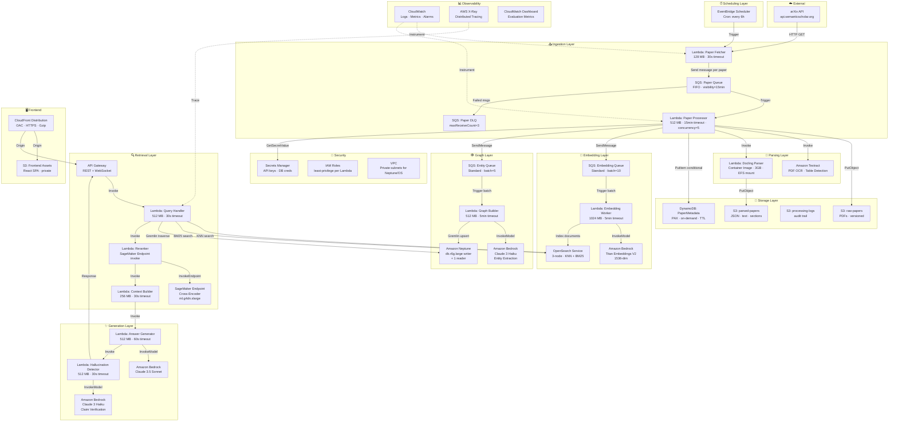

# 🏛️ AWS Architecture — Research Domain Enquirer

> Full component-level design of every AWS service, how they connect, and why each was chosen.

---

## High-Level System Map



---

## Component Deep-Dive

### 1. EventBridge Scheduler

| Property | Value |
|----------|-------|
| Schedule | `rate(6 hours)` — configurable per category |
| Target | Lambda: Paper Fetcher (async invocation) |
| Payload | `{ "categories": ["cs.AI","cs.LG","cs.CL"], "lookback_hours": 7 }` |
| Retry policy | 2 retries, 1h max age |
| Timezone | UTC |

**Why EventBridge?**  
- Managed cron — no EC2 scheduler to maintain  
- Native Lambda target with retry policy  
- Easy to add multiple schedules per arXiv category  
- Can be paused/resumed from AWS Console without code deploy  

---

### 2. Lambda: Paper Fetcher

| Property | Value |
|----------|-------|
| Runtime | Python 3.11 |
| Memory | 128 MB |
| Timeout | 30s |
| Trigger | EventBridge |
| Concurrency | 1 (reserved — only one fetcher at a time) |
| IAM | SQS:SendMessage, DynamoDB:GetItem |

**Responsibilities:**
1. Call arXiv API (`export.arxiv.org/api/query`) with date filter + categories
2. Parse Atom XML response → extract paper IDs, titles, authors, URLs
3. For each paper: `DynamoDB.get_item(paper_id)` — skip if already exists
4. For new papers: send one SQS message per paper to Paper Queue
5. Log fetch count to CloudWatch custom metric `papers_fetched`

**Rate limiting:**  
arXiv requests 3s delay between API calls.  
Lambda fetches in pages of 100, respects `x-ratelimit-*` headers.

---

### 3. SQS: Paper Queue (FIFO)

| Property | Value |
|----------|-------|
| Type | FIFO (ensures ordered processing) |
| Visibility timeout | 900s (15 min = Lambda max timeout) |
| Message retention | 4 days |
| DLQ | Paper DLQ after 3 failed deliveries |
| Batch size | 1 (one paper per Lambda invocation) |

**Message schema:**
```json
{
  "paper_id": "2401.12345",
  "title": "Attention Is All You Need (2024 Edition)",
  "authors": ["Author A", "Author B"],
  "published": "2024-01-15T00:00:00Z",
  "categories": ["cs.AI", "cs.LG"],
  "abstract": "...",
  "pdf_url": "https://arxiv.org/pdf/2401.12345",
  "doi": "10.48550/arXiv.2401.12345",
  "enqueued_at": "2024-01-15T06:00:00Z"
}
```

---

### 4. Lambda: Paper Processor

| Property | Value |
|----------|-------|
| Runtime | Python 3.11 (container image) |
| Memory | 512 MB |
| Timeout | 900s (15 min) |
| Concurrency | Reserved = 5 (rate-limit safety) |
| Trigger | SQS Paper Queue |
| EFS | `/mnt/tmp` for large PDF scratch space |

**Responsibilities:**
1. Download PDF from arXiv → stream to S3 (`s3://raw-papers/{paper_id}.pdf`)
2. Invoke Textract async job for OCR/table extraction
3. Invoke Docling Lambda for structured section parsing
4. Clean text (remove headers/footers, normalize Unicode, preserve LaTeX)
5. Extract metadata → write to DynamoDB (conditional, idempotent)
6. Chunk text using Late Chunking strategy
7. Send chunk batch to Embedding Queue
8. Send entity extraction request to Entity Queue

---

### 5. Amazon Textract

Used as fallback/supplement for scanned PDFs and table extraction.

| Mode | Usage |
|------|-------|
| `StartDocumentTextDetection` | Scanned PDFs (async) |
| `AnalyzeDocument` (Tables) | Extract structured tables |
| `AnalyzeDocument` (Forms) | Paper metadata forms |

Results stored to S3 (`s3://parsed-papers/{paper_id}/textract/`)  
Textract SNS notification → triggers a small completion Lambda.

---

### 6. Amazon OpenSearch Service

| Property | Value |
|----------|-------|
| Version | OpenSearch 2.11 |
| Instance type | `r6g.large.search` × 3 nodes |
| Storage | 500 GB gp3 EBS per node |
| Indexes | `paper_chunks` (KNN + BM25) |
| KNN dimensions | 1536 (Titan Embeddings V2) |
| KNN algorithm | HNSW (ef_construction=512, m=16) |

**Index mapping (paper_chunks):**
```json
{
  "mappings": {
    "properties": {
      "chunk_id":       { "type": "keyword" },
      "paper_id":       { "type": "keyword" },
      "section":        { "type": "keyword" },
      "page":           { "type": "integer" },
      "text":           { "type": "text", "analyzer": "english" },
      "embedding":      { "type": "knn_vector", "dimension": 1536, "method": { "name": "hnsw" }},
      "entities":       { "type": "keyword" },
      "concepts":       { "type": "keyword" },
      "published_date": { "type": "date" },
      "authors":        { "type": "keyword" }
    }
  }
}
```

---

### 7. Amazon Neptune

| Property | Value |
|----------|-------|
| Engine | Neptune 1.3 (Gremlin + openCypher) |
| Instance | `db.r6g.large` writer + 1 reader |
| VPC | Private subnet (no public access) |
| Backup | Automated daily, 7-day retention |
| Query language | Apache TinkerPop Gremlin |

**Graph schema:**

```
Vertices (Nodes):
  Paper       { paper_id, title, published_date, venue }
  Author      { name, affiliation }
  Model       { name, type, parameters }
  Dataset     { name, domain, size }
  Method      { name, category }
  Benchmark   { name, metric }
  Concept     { name, domain }
  Topic       { name }

Edges (Relationships):
  Paper  --[CITES]-->         Paper
  Paper  --[INTRODUCES]-->    Model
  Paper  --[PROPOSES]-->      Method
  Paper  --[EVALUATES_ON]--> Dataset
  Paper  --[AUTHORED_BY]--> Author
  Model  --[IMPROVES]-->      Benchmark
  Method --[USES]-->          Dataset
  Paper  --[BELONGS_TO]-->   Topic
  Model  --[BASED_ON]-->      Model
```

---

### 8. Amazon Bedrock

Three separate model invocations:

| Use Case | Model | Approx Cost |
|----------|-------|-------------|
| Embeddings | `amazon.titan-embed-text-v2:0` | $0.00002/1K tokens |
| Entity Extraction | `anthropic.claude-3-haiku-20240307-v1:0` | $0.00025/1K input |
| Answer Generation | `anthropic.claude-3-5-sonnet-20241022-v2:0` | $0.003/1K input |
| Hallucination Verify | `anthropic.claude-3-haiku-20240307-v1:0` | $0.00025/1K input |

---

### 9. SageMaker: Cross-Encoder Reranker

| Property | Value |
|----------|-------|
| Instance | `ml.g4dn.xlarge` (1x T4 GPU) |
| Model | `cross-encoder/ms-marco-MiniLM-L-12-v2` |
| Latency | ~80ms for 20 candidates |
| Scaling | Auto-scaling min=1, max=3 |
| Invocation | Sync from Lambda (< 5s timeout) |

---

### 10. API Gateway

| Endpoint | Method | Lambda | Description |
|----------|--------|--------|-------------|
| `/query` | POST | Query Handler | Submit research question |
| `/papers/{id}` | GET | Paper API | Get paper metadata |
| `/papers/{id}/chunks` | GET | Chunk API | Get paper chunks |
| `/graph/entity/{name}` | GET | Graph API | Get entity neighborhood |
| `/graph/citation/{id}` | GET | Graph API | Get citation graph |
| `/evaluate` | POST | Eval API | Run evaluation suite |
| `/ws` | WebSocket | Stream Handler | Streaming answer delivery |

---

### 11. Networking & VPC

```
VPC: 10.0.0.0/16
├── Private Subnet A (10.0.1.0/24) — AZ-a
│   ├── Neptune cluster
│   └── OpenSearch cluster
├── Private Subnet B (10.0.2.0/24) — AZ-b
│   ├── Neptune replica
│   └── OpenSearch replica
└── No public subnets for data stores

Lambda functions: VPC-attached for Neptune/OpenSearch access
Interface VPC Endpoints:
  ├── Bedrock
  ├── S3 (Gateway endpoint)
  ├── DynamoDB (Gateway endpoint)
  ├── Secrets Manager
  └── SQS
```

All traffic stays within AWS — no data leaves the VPC for database calls.

---

### 12. Security

| Layer | Control |
|-------|---------|
| IAM | Per-Lambda least-privilege roles |
| KMS | S3, DynamoDB, SQS encrypted at rest |
| Secrets Manager | arXiv API key, Neptune/OS credentials |
| VPC | Neptune and OpenSearch in private subnets |
| API Gateway | Cognito Authorizer (optional) or API key |
| CloudTrail | Audit log all API calls |
| WAF | On CloudFront — rate limiting, bot protection |

---

*See individual pipeline files for step-by-step data flows.*
