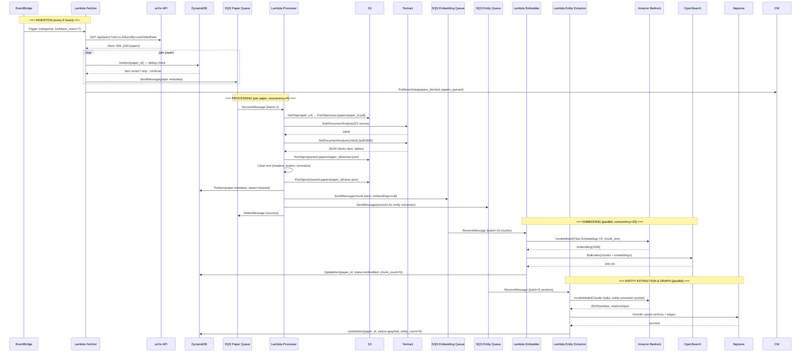
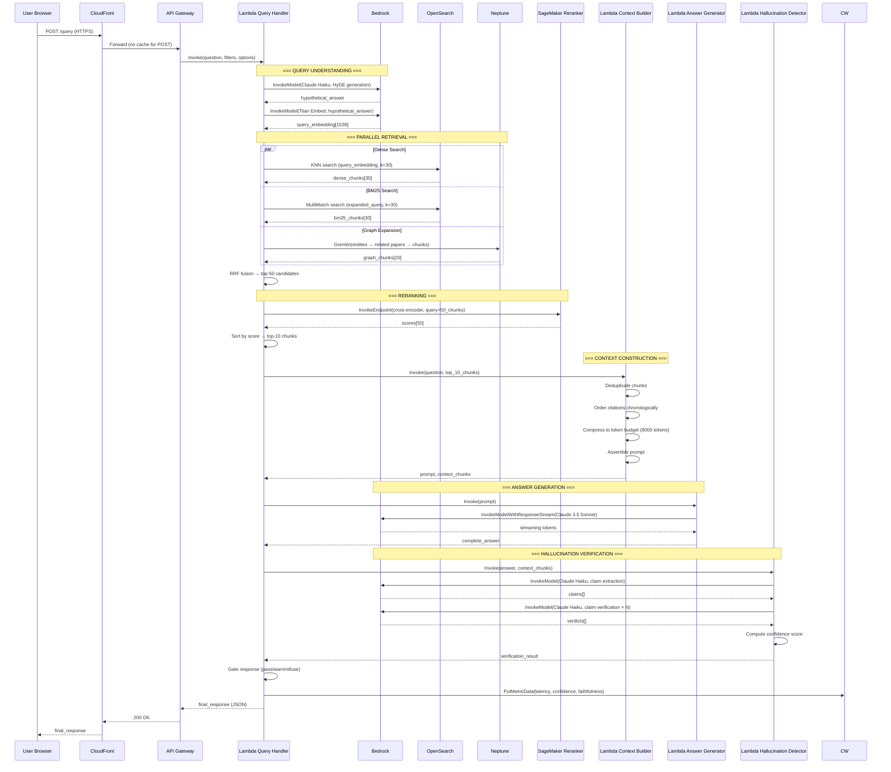

# 🔁 Data Flow — Research Domain Enquirer

> End-to-end data flow, event contracts, SQS message schemas, and component communication patterns.

---

## Complete Data Flow Sequence



---

## Query-Time Data Flow



---

## SQS Message Schemas

### 1. Paper Queue (FIFO) Message

```json
{
  "MessageGroupId": "arxiv-cs-AI",
  "MessageDeduplicationId": "2401.12345",
  "Body": {
    "schema_version": "1.0",
    "message_type": "new_paper",
    "paper_id": "2401.12345",
    "title": "Attention Is All You Need: A 2024 Perspective",
    "authors": [
      { "name": "Vaswani, Ashish", "affiliation": "Google Brain" },
      { "name": "Shazeer, Noam", "affiliation": "Google Brain" }
    ],
    "published": "2024-01-15T00:00:00Z",
    "updated": "2024-01-16T00:00:00Z",
    "categories": ["cs.AI", "cs.LG"],
    "primary_category": "cs.AI",
    "abstract": "We revisit the original Transformer architecture...",
    "pdf_url": "https://arxiv.org/pdf/2401.12345",
    "abs_url": "https://arxiv.org/abs/2401.12345",
    "doi": "10.48550/arXiv.2401.12345",
    "comment": "20 pages, 8 figures",
    "enqueued_at": "2024-01-15T06:01:23Z",
    "ingestion_run_id": "run_20240115_060000",
    "fetch_source": "arxiv_api"
  }
}
```

### 2. Embedding Queue Message

```json
{
  "schema_version": "1.0",
  "message_type": "embed_chunks",
  "paper_id": "2401.12345",
  "embedding_model": "amazon.titan-embed-text-v2:0",
  "chunks": [
    {
      "chunk_id": "2401.12345_abstract_chunk0",
      "paper_id": "2401.12345",
      "section_id": "abstract",
      "section_title": "Abstract",
      "chunk_index": 0,
      "text": "We revisit the original Transformer architecture from the perspective of...",
      "page": 1,
      "token_start": 0,
      "token_end": 287,
      "char_count": 423,
      "has_equations": false,
      "has_tables": false,
      "entities": ["Transformer", "attention mechanism"],
      "concepts": ["attention", "self-attention", "multi-head attention"],
      "published_date": "2024-01-15",
      "authors": ["Vaswani, Ashish"],
      "title": "Attention Is All You Need: A 2024 Perspective"
    }
  ],
  "total_chunks": 52,
  "enqueued_at": "2024-01-15T06:04:17Z"
}
```

### 3. Entity Queue Message

```json
{
  "schema_version": "1.0",
  "message_type": "extract_entities",
  "paper_id": "2401.12345",
  "title": "Attention Is All You Need: A 2024 Perspective",
  "authors": ["Vaswani, Ashish", "Shazeer, Noam"],
  "published": "2024-01-15",
  "categories": ["cs.AI", "cs.LG"],
  "sections": [
    {
      "section_id": "abstract",
      "title": "Abstract",
      "text": "We revisit the original Transformer architecture..."
    },
    {
      "section_id": "sec_1",
      "title": "1. Introduction",
      "text": "The Transformer [1] has become the dominant architecture..."
    }
  ],
  "references": [
    {
      "ref_id": "[1]",
      "title": "Attention Is All You Need",
      "authors": ["Vaswani, A."],
      "year": 2017,
      "arxiv_id": "1706.03762"
    }
  ],
  "enqueued_at": "2024-01-15T06:04:18Z"
}
```

---

## DynamoDB Event Patterns

### PaperMetadata State Machine

```
Initial state: "fetched"
         ↓
     "downloading" (Paper Processor starts)
         ↓
     "parsed"    (Docling/Textract complete)
         ↓
     "cleaned"   (Text cleaning complete)
         ↓
     "chunked"   (Late chunking complete, sent to Embedding Queue)
         ↓
     "embedded"  (OpenSearch index complete)
         ↓
     "graphed"   (Neptune entity graph complete)
         ↓
     "complete"  ← Final state (all pipelines done)
     
Error states:
     "failed_download"
     "failed_parse"
     "failed_embed"
     "failed_graph"
```

### DynamoDB Streams → EventBridge Pipe

```
DynamoDB Stream on PaperMetadata table
    → EventBridge Pipe filter: newImage.processing_status = "complete"
    → EventBridge bus: paper-complete-event
    → Target: SNS notification (optional)
    → Target: CloudWatch metric (papers_completed counter)
```

---

## API Gateway → Lambda Event Schemas

### POST /query — Request Event

```json
{
  "httpMethod": "POST",
  "path": "/query",
  "headers": {
    "Content-Type": "application/json",
    "X-Request-ID": "req_abc123",
    "Authorization": "Bearer eyJ..."
  },
  "body": "{\"question\": \"How does LoRA compare to full fine-tuning?\", \"filters\": {\"date_from\": \"2022-01-01\", \"categories\": [\"cs.LG\"]}, \"options\": {\"stream\": false, \"include_graph\": true}}",
  "requestContext": {
    "requestId": "req_abc123",
    "identity": { "sourceIp": "1.2.3.4" }
  }
}
```

### Lambda → API Gateway Response

```json
{
  "statusCode": 200,
  "headers": {
    "Content-Type": "application/json",
    "X-Request-ID": "req_abc123",
    "X-Confidence-Score": "0.91",
    "X-Total-Latency-Ms": "3241"
  },
  "body": "{\"answer\": \"LoRA reduces trainable parameters...\", \"citations\": [...], \"confidence\": 0.91, \"graph_context\": {...}, \"retrieval_metadata\": {...}, \"verification\": {...}}"
}
```

---

## CloudWatch Custom Metrics Taxonomy

All metrics use namespace: `ResearchRAG`

### Ingestion Metrics

| Metric Name | Unit | Dimensions |
|-------------|------|-----------|
| `papers_fetched` | Count | `category` |
| `papers_skipped_dedup` | Count | `category` |
| `papers_queued` | Count | `category` |
| `papers_failed_download` | Count | None |
| `papers_failed_parse` | Count | `parser_type` |
| `papers_complete` | Count | `category` |
| `chunks_created` | Count | None |
| `entities_extracted` | Count | `entity_type` |
| `relationships_created` | Count | `rel_type` |

### Retrieval Metrics

| Metric Name | Unit | Dimensions |
|-------------|------|-----------|
| `dense_retrieval_latency` | Milliseconds | None |
| `bm25_retrieval_latency` | Milliseconds | None |
| `graph_expansion_latency` | Milliseconds | None |
| `reranking_latency` | Milliseconds | None |
| `total_retrieval_latency` | Milliseconds | None |
| `chunks_retrieved_dense` | Count | None |
| `chunks_retrieved_bm25` | Count | None |
| `chunks_from_graph` | Count | None |

### Generation Metrics

| Metric Name | Unit | Dimensions |
|-------------|------|-----------|
| `llm_generation_latency` | Milliseconds | `model_id` |
| `total_e2e_latency` | Milliseconds | None |
| `confidence_score` | None (0-1) | `quality_badge` |
| `claims_total` | Count | None |
| `claims_supported` | Count | None |
| `claims_unsupported` | Count | None |
| `claims_contradicted` | Count | None |
| `citation_accuracy` | None (0-1) | None |
| `evidence_coverage` | None (0-1) | None |
| `response_gate_action` | Count | `action` (PASS/WARN/REFUSE) |

### Evaluation Metrics (Daily)

| Metric Name | Unit | Dimensions |
|-------------|------|-----------|
| `eval_recall_at_5` | None | `dataset_version` |
| `eval_recall_at_10` | None | `dataset_version` |
| `eval_mrr` | None | `dataset_version` |
| `eval_hit_rate_at_10` | None | `dataset_version` |
| `eval_ndcg_at_10` | None | `dataset_version` |
| `eval_faithfulness` | None | `dataset_version` |
| `eval_groundedness` | None | `dataset_version` |
| `eval_citation_accuracy` | None | `dataset_version` |
| `eval_answer_relevance` | None | `dataset_version` |

---

## Inter-Lambda Communication Pattern

Lambda functions **never call each other directly** except in the retrieval hot path. All ingestion is SQS-driven (async, decoupled).

```
ASYNC (SQS-driven):
  Fetcher → SQS → Processor → SQS → Embedder
                             → SQS → EntityExtractor

SYNC (direct invocation, retrieval path only):
  QueryHandler → Reranker Lambda (sync, 30s timeout)
  QueryHandler → ContextBuilder Lambda (sync, 30s timeout)
  QueryHandler → AnswerGenerator Lambda (sync, 60s timeout)
  QueryHandler → HallucinationDetector Lambda (sync, 30s timeout)

Why sync for retrieval?
  Retrieval is user-facing and needs a single response in < 6s.
  SQS async would require polling or websocket callbacks — more complex.
  All retrieval Lambdas are fast (< 5s individually).
```

---

## X-Ray Tracing Map

```
API Gateway
    └─► [Trace: QueryHandler]
            ├─► [Subsegment: QueryUnderstanding]
            │       ├─► Bedrock::InvokeModel (Claude Haiku HyDE)
            │       └─► Bedrock::InvokeModel (Titan Embed)
            ├─► [Subsegment: ParallelRetrieval]
            │       ├─► OpenSearch::Search (dense)
            │       ├─► OpenSearch::Search (BM25)
            │       └─► Neptune::GremlinQuery
            ├─► [Subsegment: RRFFusion]
            ├─► [Subsegment: Reranking]
            │       └─► SageMaker::InvokeEndpoint
            ├─► [Subsegment: ContextBuilder]
            ├─► [Subsegment: AnswerGeneration]
            │       └─► Bedrock::InvokeModel (Claude 3.5 Sonnet)
            └─► [Subsegment: HallucinationDetection]
                    ├─► Bedrock::InvokeModel (Claude Haiku — claim extract)
                    └─► Bedrock::InvokeModel (Claude Haiku — verify × N)
```

X-Ray service map visible in AWS Console → X-Ray → Service Map.  
Traces sampled at 5% in production (configurable via `XRAY_SAMPLING_RATE`).

---

*See [FRONTEND.md](./FRONTEND.md) for how this data flow is visualized in the Research Chat UI.*
