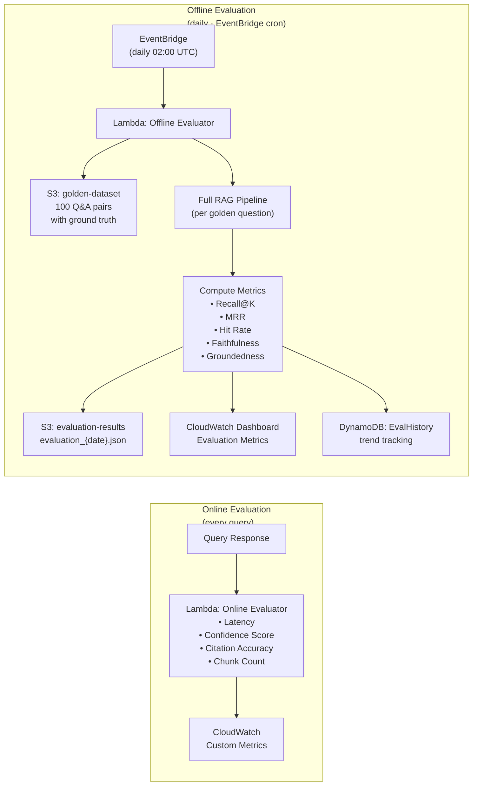

# 📊 Evaluation Pipeline — Research Domain Enquirer

> Covers: Retrieval metrics (Recall@K, MRR, Hit Rate) · Generation metrics (Faithfulness, Groundedness, Citation Accuracy) · Latency tracking · Evaluation Lambda · CloudWatch Dashboard

---

## Overview

The Evaluation Pipeline runs both **online** (every query, lightweight metrics) and **offline** (scheduled, deep evaluation against a golden dataset).



---

## Retrieval Metrics

### 1. Recall@K

**Definition:** Fraction of relevant chunks found in top-K retrieved results.

```
Recall@K = |Relevant ∩ Retrieved_top_K| / |Relevant|

Example:
  Ground truth relevant chunks: {chunk_A, chunk_B, chunk_C}
  Retrieved top-10: {chunk_A, chunk_D, chunk_B, chunk_E, ...}
  
  Recall@10 = 2 / 3 = 0.667
```

**Computed at K = 5, 10, 20 per evaluation run.**

### 2. Mean Reciprocal Rank (MRR)

**Definition:** Average of the reciprocal rank of the first relevant result.

```
MRR = (1/|Q|) × Σ (1 / rank_of_first_relevant)

Example for 3 queries:
  Query 1: first relevant at rank 1 → 1/1 = 1.0
  Query 2: first relevant at rank 3 → 1/3 = 0.333
  Query 3: first relevant at rank 2 → 1/2 = 0.5
  
  MRR = (1.0 + 0.333 + 0.5) / 3 = 0.611
```

### 3. Hit Rate@K

**Definition:** Fraction of queries where at least one relevant chunk appears in top-K.

```
Hit Rate@K = |queries where Recall@K > 0| / |total queries|

A binary version of Recall@K — did we find ANYTHING relevant?
```

### 4. Normalized Discounted Cumulative Gain (nDCG@K)

```
DCG@K = Σ (relevance_i / log2(i+1)) for i in 1..K
nDCG@K = DCG@K / IDCG@K  (IDCG = ideal DCG from perfect ranking)

Relevance scores:
  3 = highly relevant (contains direct answer)
  2 = relevant (supporting context)
  1 = marginally relevant (tangentially related)
  0 = not relevant
```

---

## Generation Metrics

### 1. Faithfulness

**Definition:** Fraction of claims in the answer that are supported by the retrieved context.

```python
def compute_faithfulness(answer: str, context_chunks: list) -> float:
    """
    Uses the hallucination detector verdicts.
    Faithfulness = supported_claims / total_claims
    
    Range: 0.0 (completely unfaithful) → 1.0 (fully grounded)
    """
    verdicts = hallucination_detector.verify(answer, context_chunks)
    
    supported = sum(1 for v in verdicts if v["verdict"] in ["SUPPORTED", "PARTIALLY_SUPPORTED"])
    total = len(verdicts)
    
    return supported / total if total > 0 else 1.0
```

**Targets:**
- Production minimum: faithfulness ≥ 0.80  
- Alert if faithfulness < 0.70 for 10+ consecutive queries

### 2. Groundedness (RAGAS-style)

**Definition:** Are ALL factual claims supported by context? Stricter than faithfulness.

```python
def compute_groundedness(answer: str, context_chunks: list) -> float:
    """
    Groundedness = fully_supported_claims / total_claims
    (PARTIALLY_SUPPORTED counts as 0, not 0.5)
    
    Uses Claude Haiku NLI for each claim-evidence pair.
    """
    verdicts = hallucination_detector.verify(answer, context_chunks)
    
    fully_supported = sum(1 for v in verdicts if v["verdict"] == "SUPPORTED")
    total = len(verdicts)
    
    return fully_supported / total if total > 0 else 1.0
```

### 3. Citation Accuracy

**Definition:** Fraction of `[paper_id]` citations in the answer that are valid (exist in context).

```python
def citation_accuracy(answer: str, context_chunks: list) -> float:
    cited_ids = re.findall(r'\[(\d{4}\.\d{5})\]', answer)
    valid_ids = {c["paper_id"] for c in context_chunks}
    
    if not cited_ids:
        return 1.0  # No citations needed, neutral score
    
    valid_count = sum(1 for cid in cited_ids if cid in valid_ids)
    return valid_count / len(cited_ids)
```

### 4. Answer Relevance

**Definition:** Does the answer actually address the question?

```
Prompt to Claude Haiku:
"Does the following answer directly address the question?
Score 1-5:
  5 = Directly and completely answers the question
  4 = Mostly answers, minor gaps
  3 = Partially answers, significant gaps
  2 = Tangentially related but doesn't answer
  1 = Completely irrelevant

Question: {question}
Answer: {answer}

Output: {"score": X, "reason": "..."}"

Normalized: (score - 1) / 4  → 0.0 to 1.0
```

### 5. Context Utilization

**Definition:** What fraction of the retrieved context was actually referenced in the answer?

```python
def context_utilization(answer: str, context_chunks: list) -> float:
    cited_paper_ids = set(re.findall(r'\[(\d{4}\.\d{5})\]', answer))
    all_paper_ids = {c["paper_id"] for c in context_chunks}
    
    return len(cited_paper_ids) / len(all_paper_ids) if all_paper_ids else 0.0
```

---

## Latency Metrics

All latency metrics are tracked as CloudWatch custom metrics with P50, P90, P95, P99 percentiles.

| Metric Name | What it measures |
|-------------|-----------------|
| `query_understanding_latency_ms` | Query expansion + HyDE embedding time |
| `dense_retrieval_latency_ms` | OpenSearch KNN search time |
| `bm25_retrieval_latency_ms` | OpenSearch BM25 search time |
| `graph_expansion_latency_ms` | Neptune Gremlin traversal time |
| `reranking_latency_ms` | SageMaker cross-encoder time |
| `context_construction_latency_ms` | Dedup + compress + prompt assembly |
| `llm_generation_latency_ms` | Bedrock Claude generation time |
| `hallucination_detection_latency_ms` | Claim verification time |
| `total_e2e_latency_ms` | Full pipeline from query to response |

**SLO Targets:**

| Percentile | Target |
|-----------|--------|
| P50 | < 2.5s |
| P90 | < 4.5s |
| P95 | < 6.0s |
| P99 | < 10.0s |

---

## Golden Dataset

The offline evaluation uses a curated set of 100 questions with human-annotated ground truth.

### Golden Dataset Schema

```json
{
  "eval_id": "eval_001",
  "question": "What is the key contribution of LoRA compared to full fine-tuning?",
  "difficulty": "medium",
  "category": "method_comparison",
  "ground_truth_answer": "LoRA introduces low-rank decomposition matrices...",
  "relevant_paper_ids": ["2106.09685", "2302.00001"],
  "relevant_chunk_ids": [
    "2106.09685_abstract_chunk0",
    "2106.09685_sec3_chunk1"
  ],
  "ground_truth_citations": ["[2106.09685]"],
  "expected_entities": ["LoRA", "low-rank adaptation", "full fine-tuning"],
  "annotated_by": "human",
  "created_at": "2024-01-10"
}
```

### Golden Dataset Categories

| Category | Count | Description |
|----------|-------|-------------|
| `method_comparison` | 25 | Compare ML methods/approaches |
| `model_evaluation` | 20 | Model performance on benchmarks |
| `concept_explanation` | 15 | Explain technical concepts |
| `historical_progression` | 10 | How a field evolved over time |
| `dataset_description` | 10 | What is this dataset / how used |
| `author_attribution` | 5 | Who introduced concept X |
| `multi_hop_reasoning` | 15 | Require 2+ papers to answer |

### Golden Dataset S3 Location

```
s3://research-evaluation/
├── golden_dataset/
│   ├── golden_qa_v1.json          ← 100 Q&A pairs
│   ├── golden_qa_v2.json          ← Updated, expanded set
│   └── annotation_guidelines.md
├── results/
│   ├── eval_2024-01-15.json
│   ├── eval_2024-01-16.json
│   └── ...
└── reports/
    └── weekly_eval_report.html
```

---

## Offline Evaluation Lambda

### Evaluation Run Schedule

```
EventBridge Rule: cron(0 2 * * ? *)  → daily at 02:00 UTC
Target: Lambda: Offline Evaluator
Payload: {
  "dataset_version": "v2",
  "max_questions": 100,
  "eval_run_id": "eval_{YYYY-MM-DD}"
}
```

### Evaluation Lambda Logic

```python
def run_evaluation(event, context):
    """
    Runs full RAG pipeline for each golden question,
    computes all metrics, stores results to S3 + DynamoDB.
    """
    golden_dataset = load_from_s3("s3://research-evaluation/golden_dataset/golden_qa_v2.json")
    
    results = []
    for qa_pair in golden_dataset:
        
        # Run full pipeline
        pipeline_response = rag_pipeline.query(
            question=qa_pair["question"],
            options={"include_evaluation": True}
        )
        
        # Compute retrieval metrics
        retrieved_chunk_ids = [c["chunk_id"] for c in pipeline_response["chunks"]]
        relevant_chunk_ids = qa_pair["relevant_chunk_ids"]
        
        recall_5  = compute_recall_at_k(retrieved_chunk_ids[:5],  relevant_chunk_ids)
        recall_10 = compute_recall_at_k(retrieved_chunk_ids[:10], relevant_chunk_ids)
        mrr       = compute_mrr(retrieved_chunk_ids, relevant_chunk_ids)
        hit_rate  = compute_hit_rate(retrieved_chunk_ids[:10], relevant_chunk_ids)
        ndcg_10   = compute_ndcg_at_k(retrieved_chunk_ids[:10], relevant_chunk_ids, k=10)
        
        # Compute generation metrics
        faithfulness     = compute_faithfulness(pipeline_response["answer"], pipeline_response["chunks"])
        groundedness     = compute_groundedness(pipeline_response["answer"], pipeline_response["chunks"])
        citation_acc     = citation_accuracy(pipeline_response["answer"], pipeline_response["chunks"])
        answer_relevance = compute_answer_relevance(qa_pair["question"], pipeline_response["answer"])
        
        results.append({
            "eval_id": qa_pair["eval_id"],
            "question": qa_pair["question"],
            "metrics": {
                "recall_at_5": recall_5,
                "recall_at_10": recall_10,
                "mrr": mrr,
                "hit_rate_at_10": hit_rate,
                "ndcg_at_10": ndcg_10,
                "faithfulness": faithfulness,
                "groundedness": groundedness,
                "citation_accuracy": citation_acc,
                "answer_relevance": answer_relevance,
                "e2e_latency_ms": pipeline_response["latency_ms"],
                "confidence": pipeline_response["confidence"]
            }
        })
    
    # Aggregate scores
    aggregated = aggregate_metrics(results)
    
    # Store results
    store_to_s3(results, f"s3://research-evaluation/results/eval_{today}.json")
    store_to_dynamodb(aggregated, eval_run_id)
    
    # Publish to CloudWatch
    publish_eval_metrics_to_cloudwatch(aggregated)
    
    # Alert if regression
    check_regression_and_alert(aggregated)
    
    return aggregated
```

---

## CloudWatch Dashboard — Evaluation Metrics

### Dashboard: `ResearchRAG-Evaluation`

```
┌─────────────────────────────────────────────────────────────────┐
│                    RETRIEVAL METRICS (7d trend)                  │
├──────────────────┬──────────────────┬────────────────────────────┤
│  Recall@10       │  MRR             │  Hit Rate@10               │
│  ████████ 0.84   │  ████████ 0.79   │  █████████ 0.92            │
│  Target: 0.80    │  Target: 0.75    │  Target: 0.90              │
│  ✅ PASS          │  ✅ PASS          │  ✅ PASS                    │
├──────────────────┴──────────────────┴────────────────────────────┤
│                   GENERATION METRICS (7d trend)                   │
├──────────────────┬──────────────────┬────────────────────────────┤
│  Faithfulness    │  Groundedness    │  Citation Accuracy         │
│  ███████ 0.91    │  ██████ 0.85     │  █████████ 0.97            │
│  Target: 0.85    │  Target: 0.80    │  Target: 0.95              │
│  ✅ PASS          │  ✅ PASS          │  ✅ PASS                    │
├──────────────────┴──────────────────┴────────────────────────────┤
│                     LATENCY (real-time P95)                       │
├──────────────────┬──────────────────┬────────────────────────────┤
│  E2E P50         │  E2E P95         │  E2E P99                   │
│  2.1s            │  4.2s            │  7.8s                      │
│  Target: <2.5s   │  Target: <6.0s   │  Target: <10.0s            │
│  ✅ PASS          │  ✅ PASS          │  ✅ PASS                    │
├──────────────────┴──────────────────┴────────────────────────────┤
│  INGESTION PIPELINE STATUS                                        │
│  Papers ingested today: 147 | Failed: 2 | DLQ depth: 0          │
│  Last fetch: 2024-01-15 12:00 UTC | Next: 18:00 UTC              │
└─────────────────────────────────────────────────────────────────┘
```

### CloudWatch Alarms

| Alarm | Threshold | Action |
|-------|-----------|--------|
| Recall@10 drops below 0.70 | 2 consecutive eval runs | SNS → Email + Slack |
| Faithfulness below 0.75 | Daily eval | SNS → Email |
| E2E P95 latency > 8s | 5min sustained | SNS → PagerDuty |
| Citation accuracy < 0.90 | Daily eval | SNS → Email |
| Confidence score avg < 0.65 | Rolling 1h | SNS → Email |
| Refusal rate > 15% | Rolling 1h | SNS → PagerDuty |

---

## Regression Detection

After each daily eval, compare against the previous 7 days:

```python
def check_regression_and_alert(current_metrics: dict, historical_metrics: list):
    baseline = aggregate_historical(historical_metrics[-7:])  # 7-day baseline
    
    regressions = []
    for metric_name, current_value in current_metrics.items():
        baseline_value = baseline.get(metric_name, current_value)
        threshold = REGRESSION_THRESHOLDS.get(metric_name, 0.05)
        
        delta = baseline_value - current_value
        if delta > threshold:
            regressions.append({
                "metric": metric_name,
                "baseline": baseline_value,
                "current": current_value,
                "delta": -delta,
                "severity": "critical" if delta > threshold * 2 else "warning"
            })
    
    if regressions:
        sns.publish(
            TopicArn=ALERTS_TOPIC_ARN,
            Subject=f"⚠️ RAG Evaluation Regression Detected",
            Message=format_regression_report(regressions)
        )

REGRESSION_THRESHOLDS = {
    "recall_at_10": 0.05,     # Drop of 5% is a regression
    "faithfulness": 0.05,
    "groundedness": 0.07,
    "citation_accuracy": 0.03,
    "e2e_latency_p95_ms": 1000  # 1 second increase
}
```

---

## DynamoDB: Evaluation History Table

```
Table: EvalHistory
PK: eval_date (String)   "2024-01-15"
SK: eval_run_id (String) "eval_2024-01-15-020000"

Attributes:
  recall_at_5        Number   0.78
  recall_at_10       Number   0.84
  mrr                Number   0.79
  hit_rate_at_10     Number   0.92
  ndcg_at_10         Number   0.81
  faithfulness       Number   0.91
  groundedness       Number   0.85
  citation_accuracy  Number   0.97
  answer_relevance   Number   0.88
  e2e_latency_p50    Number   2100
  e2e_latency_p95    Number   4200
  confidence_avg     Number   0.87
  papers_in_index    Number   8742
  questions_evaluated Number  100
  duration_seconds   Number   847
  created_at         String   "2024-01-15T02:14:07Z"

GSI: date-index (sort by eval_date for trend queries)
```

---

## Evaluation API Endpoint

```
POST /evaluate
Body: {
  "mode": "quick" | "full",
  "question_ids": ["eval_001", "eval_002"],  // optional: specific questions
  "compare_to": "2024-01-08"                 // optional: compare to past date
}

Response:
{
  "eval_run_id": "eval_2024-01-15-manual",
  "duration_seconds": 312,
  "metrics": {
    "recall_at_10": 0.84,
    "faithfulness": 0.91,
    ...
  },
  "comparison": {
    "vs_2024-01-08": {
      "recall_at_10": "+0.03 ✅",
      "faithfulness": "-0.02 ⚠️"
    }
  },
  "s3_report": "s3://research-evaluation/results/eval_2024-01-15-manual.json"
}
```

---

*See [FRONTEND.md](./FRONTEND.md) for how evaluation metrics are displayed on the dashboard.*
