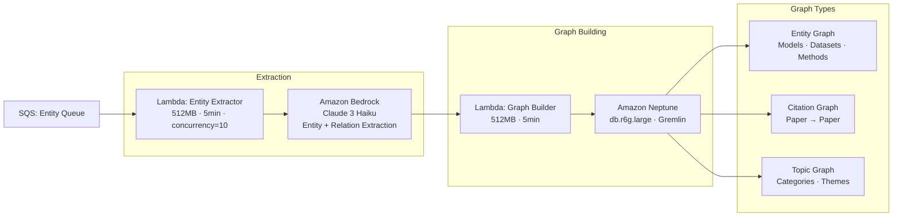
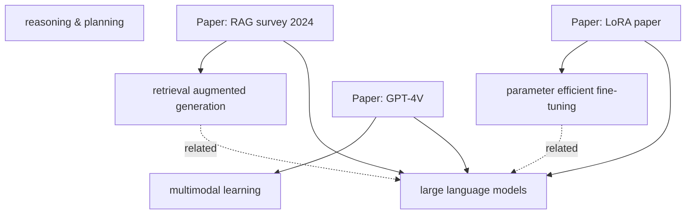

# 🕸️ Graph Pipeline — Research Domain Enquirer

> Covers: Entity extraction → Relationship mapping → Neptune graph construction → Citation graph → Topic graph

---

## Overview

The Graph Pipeline transforms unstructured research text into a **living knowledge graph** stored in Amazon Neptune. Every paper, author, model, dataset, method, and concept becomes a node. Every citation, usage, and improvement becomes an edge.



---

## Neptune Configuration

| Property | Value |
|----------|-------|
| Engine | Amazon Neptune 1.3 |
| Writer instance | `db.r6g.large` (2 vCPU, 16 GB RAM) |
| Reader instance | `db.r6g.large` × 1 |
| Multi-AZ | Enabled |
| Backup window | 02:00–03:00 UTC daily |
| Backup retention | 7 days |
| Encryption | AWS KMS (aws/neptune) |
| VPC | Private subnet — no public endpoint |
| Port | 8182 (Gremlin WebSocket) |
| Query language | Apache TinkerPop Gremlin |
| Bulk load | S3 → Neptune Loader (CSV format) |

### VPC Endpoint Access

Lambda Graph Builder connects to Neptune via:
```
Gremlin endpoint: wss://neptune-cluster.cluster-xxxx.us-east-1.neptune.amazonaws.com:8182/gremlin
Auth: IAM authentication (SigV4 signed requests)
Connection pool: 5 connections per Lambda instance
```

---

## Graph Schema — Full Vertex & Edge Definitions

### Vertex (Node) Types

```gremlin
// PAPER vertex
g.addV('Paper')
  .property('paper_id', '2401.12345')
  .property('title', 'Attention Is All You Need (2024 Edition)')
  .property('published_date', '2024-01-15')
  .property('venue', 'arXiv')
  .property('citation_count', 0)
  .property('abstract_embedding_key', 's3://...')

// AUTHOR vertex
g.addV('Author')
  .property('name', 'Ashish Vaswani')
  .property('affiliation', 'Google Brain')
  .property('normalized_name', 'vaswani_ashish')

// MODEL vertex
g.addV('Model')
  .property('name', 'GPT-4')
  .property('type', 'language_model')
  .property('parameters', '1.8T')
  .property('organization', 'OpenAI')
  .property('release_year', 2023)

// DATASET vertex
g.addV('Dataset')
  .property('name', 'GLUE')
  .property('domain', 'NLP')
  .property('task_type', 'multi-task benchmark')
  .property('size_examples', 67349)

// METHOD vertex
g.addV('Method')
  .property('name', 'LoRA')
  .property('category', 'parameter_efficient_finetuning')
  .property('full_name', 'Low-Rank Adaptation')

// BENCHMARK vertex
g.addV('Benchmark')
  .property('name', 'HumanEval')
  .property('metric', 'pass@1')
  .property('domain', 'code_generation')

// CONCEPT vertex
g.addV('Concept')
  .property('name', 'attention mechanism')
  .property('domain', 'deep_learning')
  .property('aliases', ['self-attention', 'multi-head attention'])

// TASK vertex
g.addV('Task')
  .property('name', 'machine translation')
  .property('domain', 'NLP')

// TOPIC vertex
g.addV('Topic')
  .property('name', 'large language models')
  .property('category', 'cs.CL')
```

### Edge (Relationship) Types

```gremlin
// Paper CITES Paper
g.V().has('Paper','paper_id','2401.12345')
  .addE('CITES')
  .property('context', 'As shown in [1], attention...')
  .property('section', 'related_work')
  .to(g.V().has('Paper','paper_id','1706.03762'))

// Paper INTRODUCES Model
g.V().has('Paper','paper_id','2401.12345')
  .addE('INTRODUCES')
  .property('confidence', 0.95)
  .to(g.V().has('Model','name','GPT-4o'))

// Paper PROPOSES Method
g.V().has('Paper','paper_id','2401.12345')
  .addE('PROPOSES')
  .property('is_primary_contribution', true)
  .to(g.V().has('Method','name','Chain-of-Thought'))

// Paper EVALUATES_ON Dataset
g.V().has('Paper','paper_id','2401.12345')
  .addE('EVALUATES_ON')
  .property('score', 92.4)
  .property('metric', 'F1')
  .to(g.V().has('Dataset','name','SQuAD 2.0'))

// Paper AUTHORED_BY Author
g.V().has('Paper','paper_id','2401.12345')
  .addE('AUTHORED_BY')
  .property('position', 1)
  .property('is_corresponding', true)
  .to(g.V().has('Author','normalized_name','vaswani_ashish'))

// Model IMPROVES Benchmark
g.V().has('Model','name','GPT-4')
  .addE('IMPROVES')
  .property('previous_sota', 72.3)
  .property('new_score', 86.4)
  .property('metric', 'pass@1')
  .to(g.V().has('Benchmark','name','HumanEval'))

// Method USES Dataset
g.V().has('Method','name','LoRA')
  .addE('USES')
  .property('purpose', 'fine_tuning')
  .to(g.V().has('Dataset','name','Alpaca'))

// Model BASED_ON Model (ancestry)
g.V().has('Model','name','LLaMA-3')
  .addE('BASED_ON')
  .property('relationship', 'fine_tuned_from')
  .to(g.V().has('Model','name','LLaMA-2'))

// Paper BELONGS_TO Topic
g.V().has('Paper','paper_id','2401.12345')
  .addE('BELONGS_TO')
  .property('relevance_score', 0.92)
  .to(g.V().has('Topic','name','large language models'))
```

---

## Entity Extraction Lambda

### Bedrock Prompt — Structured Entity + Relation Extraction

```
System: You are an expert AI research analyst. Extract entities and relationships
from this research paper section. Be precise and conservative — only extract
entities explicitly mentioned.

Return ONLY valid JSON matching this schema:

{
  "entities": [
    {
      "text": "string",
      "type": "MODEL|DATASET|METHOD|BENCHMARK|CONCEPT|TASK|METRIC|AUTHOR",
      "normalized_name": "string (lowercase, underscores)",
      "confidence": 0.0-1.0
    }
  ],
  "relationships": [
    {
      "subject": "normalized_name",
      "predicate": "INTRODUCES|PROPOSES|EVALUATES_ON|CITES|IMPROVES|USES|BASED_ON",
      "object": "normalized_name",
      "context": "brief quote supporting this relationship",
      "confidence": 0.0-1.0
    }
  ]
}

Paper metadata:
Title: {title}
Authors: {authors}
Published: {published_date}

Section: {section_title}
Text: {section_text}
```

### Entity Extraction Output Example

```json
{
  "entities": [
    { "text": "GPT-4", "type": "MODEL", "normalized_name": "gpt_4", "confidence": 0.99 },
    { "text": "MMLU", "type": "BENCHMARK", "normalized_name": "mmlu", "confidence": 0.98 },
    { "text": "chain-of-thought prompting", "type": "METHOD", "normalized_name": "chain_of_thought_prompting", "confidence": 0.96 },
    { "text": "85.4% accuracy", "type": "METRIC", "normalized_name": "accuracy", "confidence": 0.94 }
  ],
  "relationships": [
    {
      "subject": "gpt_4",
      "predicate": "IMPROVES",
      "object": "mmlu",
      "context": "GPT-4 achieves 85.4% on MMLU, surpassing previous SOTA",
      "confidence": 0.92
    },
    {
      "subject": "paper_2401.12345",
      "predicate": "EVALUATES_ON",
      "object": "mmlu",
      "context": "We evaluate on the MMLU benchmark",
      "confidence": 0.97
    }
  ]
}
```

---

## Graph Builder Lambda

### Upsert Strategy (Idempotent)

Every write to Neptune uses **upsert** (merge) semantics to prevent duplicates:

```gremlin
// Upsert vertex — creates if missing, gets if exists
g.V().has('Model', 'normalized_name', 'gpt_4')
  .fold()
  .coalesce(
    __.unfold(),
    __.addV('Model').property('normalized_name', 'gpt_4').property('name', 'GPT-4')
  )
  .property('last_seen', '2024-01-15')

// Upsert edge — only add if not exists
g.V().has('Paper','paper_id', source_id)
  .outE('INTRODUCES')
  .where(__.inV().has('Model','normalized_name', model_id))
  .fold()
  .coalesce(
    __.unfold(),
    __.V().has('Paper','paper_id', source_id)
      .addE('INTRODUCES')
      .to(__.V().has('Model','normalized_name', model_id))
  )
```

### Batch Write Strategy

```
Lambda Graph Builder processes 5 papers per invocation.
Per paper:
  1. Upsert Paper vertex
  2. Upsert all Author vertices → add AUTHORED_BY edges
  3. Upsert all entity vertices → add relationship edges
  4. Upsert all cited Paper vertices → add CITES edges
  5. Upsert Topic vertices → add BELONGS_TO edges

Gremlin writes are batched in a single transaction per paper.
Transaction size: max 500 mutations (Neptune limit per request).
```

---

## Citation Graph Construction

### Reference Parsing

References are extracted from the cleaned paper JSON:

```json
"references": [
  {
    "ref_id": "[1]",
    "title": "BERT: Pre-training of Deep Bidirectional Transformers",
    "authors": ["Devlin, J.", "Chang, M.W.", "Lee, K.", "Toutanova, K."],
    "year": 2019,
    "arxiv_id": "1810.04805",
    "doi": "10.18653/v1/N19-1423"
  }
]
```

### Citation Resolution

For each reference, we attempt to resolve to an existing paper in DynamoDB:

```
1. Exact match: arxiv_id in DynamoDB → found!
2. Fuzzy match: normalized title similarity > 0.95 → probable match
3. No match: create stub Paper vertex (paper_id = "stub_{title_hash}")
             → will be resolved when that paper is ingested later
```

### Citation Graph Use Cases

| Query | Gremlin | Use Case |
|-------|---------|----------|
| Papers cited by X | `g.V().has('paper_id',X).out('CITES')` | Reference lookup |
| Papers citing X (back-refs) | `g.V().has('paper_id',X).in('CITES')` | Find follow-up work |
| Citation depth-2 | `.out('CITES').out('CITES')` | Related paper discovery |
| Most cited papers | `g.V().hasLabel('Paper').order().by(__.in('CITES').count(), desc)` | Influence ranking |
| Co-citation clusters | PageRank on citation subgraph | Topic clustering |

---

## Topic Graph Construction

Topics are automatically inferred from:
1. arXiv categories (primary)  
2. Keyword clustering on abstracts (secondary)  
3. Entity co-occurrence patterns (tertiary)



---

## Graph Traversal Queries for Retrieval

These Gremlin queries are used during the **Graph Expansion** phase of retrieval:

### 1. Find related papers via shared entities

```gremlin
// Papers that use the same models/methods as paper X
g.V().has('Paper','paper_id', query_paper_id)
  .out('INTRODUCES', 'PROPOSES', 'EVALUATES_ON')
  .in('INTRODUCES', 'PROPOSES', 'EVALUATES_ON')
  .hasLabel('Paper')
  .dedup()
  .order().by(__.in('CITES').count(), desc)
  .limit(10)
  .valueMap('paper_id', 'title', 'published_date')
```

### 2. Find papers in citation neighborhood

```gremlin
// 2-hop citation neighbors
g.V().has('Paper','paper_id', query_paper_id)
  .union(
    __.out('CITES'),
    __.in('CITES'),
    __.out('CITES').out('CITES')
  )
  .hasLabel('Paper')
  .dedup()
  .limit(20)
  .valueMap('paper_id', 'title')
```

### 3. Find model lineage

```gremlin
// Full ancestry of a model
g.V().has('Model','normalized_name', 'llama_3')
  .repeat(__.out('BASED_ON'))
  .until(__.not(__.out('BASED_ON')))
  .path()
  .by('name')
```

### 4. Find what benchmarks a method improves

```gremlin
g.V().has('Method','normalized_name', 'chain_of_thought')
  .in('PROPOSES')       // papers proposing this method
  .out('INTRODUCES')    // models those papers introduce
  .out('IMPROVES')      // benchmarks those models improve
  .dedup()
  .valueMap('name', 'metric')
```

---

## Neptune Bulk Load (Historical Ingestion)

For loading historical papers in bulk (backfill):

```
1. Generate Neptune-format CSV files:
   s3://neptune-bulk-load/vertices/papers.csv
   s3://neptune-bulk-load/vertices/models.csv
   s3://neptune-bulk-load/edges/cites.csv
   s3://neptune-bulk-load/edges/introduces.csv

2. Trigger Neptune Loader:
   POST https://neptune-endpoint:8182/loader
   {
     "source": "s3://neptune-bulk-load/",
     "format": "csv",
     "iamRoleArn": "arn:aws:iam::ACCOUNT:role/NeptuneLoadRole",
     "region": "us-east-1",
     "failOnError": "FALSE",
     "parallelism": "MEDIUM"
   }

3. Monitor load job:
   GET https://neptune-endpoint:8182/loader/{loadId}
```

---

## Monitoring & Alerts

| Metric | Alarm Threshold | Action |
|--------|----------------|--------|
| Neptune CPU > 80% | 5 min sustained | SNS alert + scale reader |
| Neptune gremlin errors > 10/min | Immediate | SNS alert |
| Graph Builder DLQ depth > 20 | Immediate | SNS alert |
| Entity extraction failures > 5% | Rolling 1h | CloudWatch alarm |
| Neptune storage > 80% | Immediate | SNS alert |

---

*See [RETRIEVAL_ENGINE.md](./RETRIEVAL_ENGINE.md) for how the graph is queried during hybrid retrieval.*
