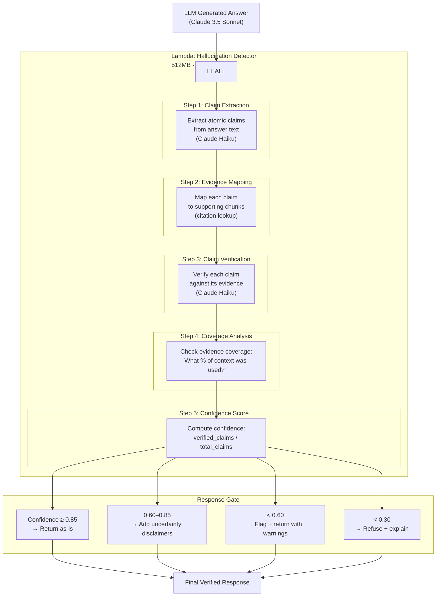

# 🛡️ Hallucination Detection — Research Domain Enquirer

> Covers: Evidence coverage · Citation grounding · Unsupported claim detection · Confidence scoring · Response gating

---

## Overview

Hallucination detection runs **after** LLM answer generation, before the response is returned to the user. It is a dedicated Lambda function that verifies every factual claim against the retrieved evidence.



---

## Step 1: Atomic Claim Extraction

The LLM answer is decomposed into atomic, verifiable claims:

### Bedrock Prompt — Claim Extraction

```
System: You are a fact-checking assistant. Extract all factual claims from
the following AI research answer. Break compound claims into atomic statements.
Focus on quantitative claims, method comparisons, and dataset results.

Output JSON:
{
  "claims": [
    {
      "claim_id": "c1",
      "text": "LoRA reduces trainable parameters by 10,000×",
      "type": "quantitative",
      "entities_mentioned": ["LoRA"],
      "citation_expected": "[2401.12345]"
    },
    {
      "claim_id": "c2",
      "text": "LoRA achieves comparable performance to full fine-tuning on GLUE",
      "type": "comparative",
      "entities_mentioned": ["LoRA", "GLUE"],
      "citation_expected": "[2401.12345]"
    }
  ]
}

Claim types: quantitative | comparative | causal | definitional | existence

Answer to analyze:
{llm_answer}
```

### Example Claim Extraction

**LLM Answer:**
> "LoRA reduces trainable parameters by approximately 10,000× compared to full fine-tuning [2401.12345]. When applied to GPT-3, it matches the quality of full fine-tuning on GLUE and SuperGLUE benchmarks [2401.12345]. The key insight is that weight updates have a low intrinsic rank [2401.67890]."

**Extracted Claims:**
```json
{
  "claims": [
    {
      "claim_id": "c1",
      "text": "LoRA reduces trainable parameters by approximately 10,000× compared to full fine-tuning",
      "type": "quantitative",
      "entities_mentioned": ["LoRA", "full fine-tuning"],
      "citation_expected": "[2401.12345]"
    },
    {
      "claim_id": "c2",
      "text": "LoRA matches the quality of full fine-tuning on GLUE when applied to GPT-3",
      "type": "comparative",
      "entities_mentioned": ["LoRA", "GPT-3", "GLUE"],
      "citation_expected": "[2401.12345]"
    },
    {
      "claim_id": "c3",
      "text": "LoRA matches the quality of full fine-tuning on SuperGLUE when applied to GPT-3",
      "type": "comparative",
      "entities_mentioned": ["LoRA", "GPT-3", "SuperGLUE"],
      "citation_expected": "[2401.12345]"
    },
    {
      "claim_id": "c4",
      "text": "Weight updates during fine-tuning have a low intrinsic rank",
      "type": "causal",
      "entities_mentioned": ["LoRA"],
      "citation_expected": "[2401.67890]"
    }
  ]
}
```

---

## Step 2: Evidence Mapping

Each claim is matched to the retrieved evidence chunks using citation references and entity overlap:

```python
def map_claims_to_evidence(claims: list, context_chunks: list) -> dict:
    claim_evidence_map = {}
    
    for claim in claims:
        supporting_chunks = []
        
        # Method 1: Citation match (explicit [paper_id] in claim)
        if claim["citation_expected"]:
            paper_id = extract_paper_id(claim["citation_expected"])
            matching = [c for c in context_chunks if c["paper_id"] == paper_id]
            supporting_chunks.extend(matching)
        
        # Method 2: Entity overlap match
        claim_entities = set(claim["entities_mentioned"])
        for chunk in context_chunks:
            chunk_entities = set(chunk.get("entities", []))
            overlap = claim_entities & chunk_entities
            if len(overlap) >= 1 and chunk not in supporting_chunks:
                supporting_chunks.append(chunk)
        
        # Method 3: Semantic similarity fallback (Titan embedding)
        if not supporting_chunks:
            claim_embedding = embed(claim["text"])
            for chunk in context_chunks:
                similarity = cosine_similarity(claim_embedding, chunk["embedding"])
                if similarity > 0.75:
                    supporting_chunks.append(chunk)
        
        claim_evidence_map[claim["claim_id"]] = supporting_chunks
    
    return claim_evidence_map
```

---

## Step 3: Claim Verification (Bedrock Claude Haiku)

For each claim, Claude Haiku judges whether the evidence supports it:

### Bedrock Prompt — Claim Verification

```
System: You are a rigorous fact-checker for AI research. Determine whether
the given claim is supported by the provided evidence chunks.

Be strict: only mark SUPPORTED if the evidence explicitly states or directly
implies the claim. Do not infer beyond what is written.

Output JSON:
{
  "verdict": "SUPPORTED" | "PARTIALLY_SUPPORTED" | "UNSUPPORTED" | "CONTRADICTED",
  "confidence": 0.0-1.0,
  "explanation": "brief reason",
  "supporting_quotes": ["exact quote from evidence that supports the claim"]
}

Claim: {claim_text}

Evidence:
[Chunk 1 from paper 2401.12345 — Abstract]
{chunk_1_text}

[Chunk 2 from paper 2401.12345 — Experiments]
{chunk_2_text}
```

### Verdict Categories

| Verdict | Meaning | Effect on Confidence |
|---------|---------|---------------------|
| `SUPPORTED` | Evidence explicitly supports the claim | +1.0 |
| `PARTIALLY_SUPPORTED` | Evidence weakly or indirectly supports | +0.5 |
| `UNSUPPORTED` | No evidence found for the claim | 0 |
| `CONTRADICTED` | Evidence contradicts the claim | −1.0 (severe) |

---

## Step 4: Evidence Coverage Analysis

Checks how much of the retrieved context was actually used in the answer:

```python
def compute_evidence_coverage(context_chunks: list, claim_evidence_map: dict) -> float:
    """
    What fraction of retrieved chunks are cited or relevant to at least one claim?
    Low coverage = LLM ignored most evidence (potential hallucination zone)
    """
    cited_chunk_ids = set()
    for claim_id, chunks in claim_evidence_map.items():
        for chunk in chunks:
            cited_chunk_ids.add(chunk["chunk_id"])
    
    total_chunks = len(context_chunks)
    covered_chunks = len(cited_chunk_ids)
    
    return covered_chunks / total_chunks if total_chunks > 0 else 0.0
```

### Coverage Interpretation

| Coverage | Meaning |
|----------|---------|
| > 0.8 | Excellent — answer grounded in most evidence |
| 0.5–0.8 | Good — answer uses majority of evidence |
| 0.2–0.5 | Moderate — answer may be going beyond evidence |
| < 0.2 | Warning — answer largely ignores retrieved context |

---

## Step 5: Confidence Score Computation

```python
def compute_confidence_score(
    claims: list,
    verdicts: dict,
    coverage: float,
    citation_accuracy: float
) -> float:
    """
    Composite confidence score from multiple signals.
    """
    # Signal 1: Claim verification score (0-1)
    verdict_scores = {
        "SUPPORTED": 1.0,
        "PARTIALLY_SUPPORTED": 0.5,
        "UNSUPPORTED": 0.0,
        "CONTRADICTED": -1.0
    }
    
    claim_score = 0.0
    for claim in claims:
        verdict = verdicts[claim["claim_id"]]["verdict"]
        weight = 1.5 if claim["type"] == "quantitative" else 1.0  # quantitative claims weighted more
        claim_score += verdict_scores[verdict] * weight
    
    max_claim_score = sum(1.5 if c["type"] == "quantitative" else 1.0 for c in claims)
    normalized_claim_score = max(0, claim_score) / max_claim_score if max_claim_score > 0 else 0
    
    # Signal 2: Evidence coverage (0-1)
    coverage_score = min(coverage * 1.25, 1.0)  # slight boost for high coverage
    
    # Signal 3: Citation accuracy — all [paper_id] citations exist in context?
    citation_score = citation_accuracy  # pre-computed: fraction of valid citations
    
    # Weighted combination
    confidence = (
        0.60 * normalized_claim_score +
        0.25 * coverage_score +
        0.15 * citation_score
    )
    
    return round(confidence, 3)
```

---

## Response Gating Logic

```python
def gate_response(answer: str, confidence: float, verdicts: dict,
                  contradicted_claims: list) -> dict:
    
    # Always block if any claim is CONTRADICTED
    if contradicted_claims:
        return {
            "action": "WARN",
            "confidence": confidence,
            "answer": add_contradiction_warnings(answer, contradicted_claims),
            "warning": f"⚠️ {len(contradicted_claims)} claim(s) may be inaccurate based on evidence.",
            "unsupported_claims": contradicted_claims
        }
    
    if confidence >= 0.85:
        return {
            "action": "PASS",
            "confidence": confidence,
            "answer": answer,
            "quality_badge": "high_confidence"
        }
    
    elif confidence >= 0.60:
        return {
            "action": "PASS_WITH_DISCLAIMER",
            "confidence": confidence,
            "answer": answer + "\n\n*Note: Some claims have limited evidence support. Please verify citations.*",
            "quality_badge": "medium_confidence",
            "unsupported_claims": [c for c in verdicts if verdicts[c]["verdict"] == "UNSUPPORTED"]
        }
    
    elif confidence >= 0.30:
        return {
            "action": "WARN",
            "confidence": confidence,
            "answer": answer,
            "warning": "⚠️ This answer has low evidence coverage. Treat with caution.",
            "quality_badge": "low_confidence"
        }
    
    else:
        return {
            "action": "REFUSE",
            "confidence": confidence,
            "answer": "I cannot provide a reliable answer to this question based on the available research papers. The evidence is insufficient or contradictory.",
            "reason": "Confidence score below minimum threshold",
            "quality_badge": "insufficient_evidence"
        }
```

---

## Citation Grounding Check

Verifies that every `[paper_id]` reference in the answer actually exists in context:

```python
def check_citation_accuracy(answer: str, context_chunks: list) -> tuple[float, list]:
    """Returns (accuracy_score, invalid_citations)"""
    
    # Extract all citation references from answer
    cited_ids = re.findall(r'\[(\d{4}\.\d{5})\]', answer)
    
    # Valid paper IDs from context
    valid_ids = {chunk["paper_id"] for chunk in context_chunks}
    
    invalid = [cid for cid in cited_ids if cid not in valid_ids]
    
    accuracy = (len(cited_ids) - len(invalid)) / len(cited_ids) if cited_ids else 1.0
    
    return accuracy, invalid
```

**Hallucinated citation example:**
```
Answer: "As shown in [2401.99999], transformers achieve SOTA on GLUE..."
                         ^^^^^^^^
                    This paper_id was NOT in the retrieved chunks
                    → invalid citation → reduces confidence score
```

---

## Full Verification Response Payload

```json
{
  "answer": "LoRA reduces trainable parameters by approximately 10,000× [2401.12345]...",
  "confidence": 0.91,
  "quality_badge": "high_confidence",
  "verification": {
    "total_claims": 4,
    "supported_claims": 3,
    "partially_supported_claims": 1,
    "unsupported_claims": 0,
    "contradicted_claims": 0,
    "evidence_coverage": 0.85,
    "citation_accuracy": 1.0,
    "verdicts": {
      "c1": {
        "verdict": "SUPPORTED",
        "confidence": 0.98,
        "supporting_quotes": ["LoRA reduces the number of trainable parameters by 10,000 times..."]
      },
      "c2": {
        "verdict": "SUPPORTED",
        "confidence": 0.94,
        "supporting_quotes": ["LoRA matches or exceeds the quality of full fine-tuning on GLUE..."]
      },
      "c3": {
        "verdict": "PARTIALLY_SUPPORTED",
        "confidence": 0.72,
        "explanation": "Evidence mentions GLUE but SuperGLUE results are not directly quoted"
      },
      "c4": {
        "verdict": "SUPPORTED",
        "confidence": 0.96,
        "supporting_quotes": ["we hypothesize that weight updates during adaptation also have a low intrinsic rank"]
      }
    }
  },
  "citations": [
    {
      "paper_id": "2401.12345",
      "title": "LoRA: Low-Rank Adaptation of Large Language Models",
      "authors": ["Hu, E.", "Shen, Y.", "Wallis, P."],
      "published": "2021-10-16",
      "url": "https://arxiv.org/abs/2106.09685",
      "chunks_used": 3
    }
  ]
}
```

---

## CloudWatch Metrics for Hallucination

| Metric | Description | Alarm Threshold |
|--------|-------------|----------------|
| `confidence_score_avg` | Rolling avg confidence | < 0.70 sustained |
| `hallucination_rate` | Fraction of CONTRADICTED verdicts | > 5% |
| `refusal_rate` | Fraction of REFUSE responses | > 10% |
| `citation_accuracy_avg` | Avg citation validity | < 0.90 |
| `unsupported_claim_rate` | Fraction of UNSUPPORTED claims | > 20% |

---

*See [EVALUATION_PIPELINE.md](./EVALUATION_PIPELINE.md) for systematic evaluation of retrieval and generation quality.*
