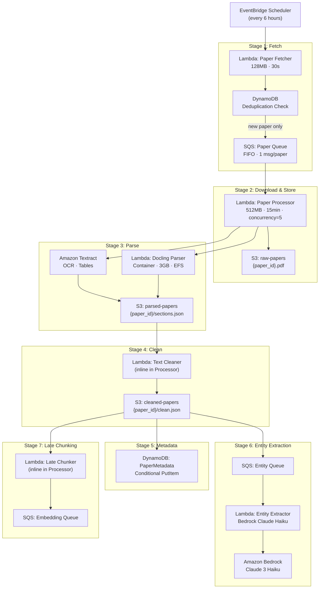

# 📥 Ingestion Pipeline — Research Domain Enquirer

> Covers: arXiv fetching → PDF download → parsing → cleaning → metadata extraction → entity extraction → late chunking

---

## Overview Flow



---

## Stage 1: arXiv Fetcher Lambda

### arXiv API Query Strategy

The fetcher queries arXiv using their Atom API with smart filtering:

```
Base URL: http://export.arxiv.org/api/query

Query parameters:
  search_query = cat:cs.AI+OR+cat:cs.LG+OR+cat:cs.CL+OR+cat:cs.CV+OR+cat:cs.NE
  start        = 0
  max_results  = 100
  sortBy       = submittedDate
  sortOrder    = descending
```

### Supported arXiv Categories

| Category | Description |
|----------|-------------|
| `cs.AI` | Artificial Intelligence |
| `cs.LG` | Machine Learning |
| `cs.CL` | Computation and Language (NLP) |
| `cs.CV` | Computer Vision |
| `cs.NE` | Neural and Evolutionary Computing |
| `cs.IR` | Information Retrieval |
| `stat.ML` | Statistics - Machine Learning |

### Deduplication Strategy

```
DynamoDB Table: PaperMetadata
Key: paper_id (String)

Fetch check:
  response = dynamodb.get_item(Key={'paper_id': paper_id})
  if response.get('Item'):
      skip (already processed)
  else:
      send to SQS Paper Queue
```

DynamoDB conditional write on processor side:  
`ConditionExpression = "attribute_not_exists(paper_id)"`  
→ prevents race conditions if two fetcher runs overlap.

### CloudWatch Metrics Published

| Metric | Description |
|--------|-------------|
| `papers_fetched` | Total papers returned by arXiv |
| `papers_skipped_dedup` | Papers already in DynamoDB |
| `papers_queued` | New papers sent to SQS |
| `api_errors` | arXiv API failures |

---

## Stage 2: PDF Download & S3 Storage

### Download Strategy

```
1. GET {pdf_url} with streaming (not loading full PDF into memory)
2. Stream to S3 multipart upload:
   s3://raw-papers/{category}/{year}/{paper_id}.pdf

3. Tag S3 object:
   paper_id   = "2401.12345"
   category   = "cs.AI"
   fetched_at = "2024-01-15T06:00:00Z"
   source     = "arxiv"

4. Set S3 lifecycle:
   - Move to S3 Intelligent-Tiering after 30 days
   - Glacier after 365 days
```

### S3 Bucket Structure

```
s3://research-raw-papers/
├── cs.AI/
│   └── 2024/
│       └── 2401.12345.pdf
├── cs.LG/
│   └── 2024/
│       └── 2401.99999.pdf
└── ...

s3://research-parsed-papers/
├── 2401.12345/
│   ├── sections.json       ← structured sections
│   ├── textract_raw.json   ← Textract output
│   ├── tables.json         ← extracted tables
│   └── equations.json      ← LaTeX equations
└── ...

s3://research-cleaned-papers/
└── 2401.12345/
    └── clean.json          ← final cleaned, structured text
```

---

## Stage 3: Document Parsing

### Primary Parser: Docling (Lambda Container)

Docling is run in a Lambda container image (because it requires heavy ML deps):

```
Container specs:
  Base image: public.ecr.aws/lambda/python:3.11
  Size: ~3 GB (includes PyTorch for table detection)
  Memory: 3008 MB
  Timeout: 10 minutes
  EFS: /mnt/docling-cache (model cache across invocations)
```

**Docling output per paper:**
```json
{
  "paper_id": "2401.12345",
  "sections": [
    {
      "section_id": "abstract",
      "title": "Abstract",
      "text": "We present...",
      "page_start": 1,
      "page_end": 1,
      "level": 0
    },
    {
      "section_id": "introduction",
      "title": "1. Introduction",
      "text": "Deep learning has...",
      "page_start": 1,
      "page_end": 3,
      "level": 1,
      "subsections": [...]
    }
  ],
  "tables": [...],
  "equations": [...],
  "figures": [...],
  "references": [...]
}
```

### Fallback Parser: Amazon Textract

Triggered when Docling fails (e.g., scanned PDF, corrupted file):

```
1. StartDocumentAnalysis(
     DocumentLocation = { S3Object: { bucket, key } },
     FeatureTypes = ["TABLES", "FORMS"]
   )
2. Poll GetDocumentAnalysis (or SNS notification)
3. Reconstruct page text from WORD/LINE blocks
4. Detect section headers via font size heuristics
```

---

## Stage 4: Document Cleaning

Cleaning runs as part of the Processor Lambda, inline after parsing.

### Cleaning Rules Applied

| Operation | Description | Method |
|-----------|-------------|--------|
| Header removal | Remove repeated page headers | Regex + frequency analysis |
| Footer removal | Remove page numbers, running titles | Regex (page N of M patterns) |
| Unicode normalization | NFD → NFC, remove non-printable | `unicodedata.normalize` |
| Hyphen rejoining | Re-join hyphenated line breaks | Regex `(\w+)-\n(\w+)` |
| Whitespace collapse | Multiple spaces/newlines → single | Regex |
| Citation placeholder | `[1]`, `[Smith et al., 2024]` → preserve | No-op (kept for grounding) |
| Equation preservation | LaTeX `$...$` and `$$...$$` → preserved as-is | Pattern detection |
| Table preservation | Markdown table format from Docling | Structural copy |
| Reference section | Parsed into structured list | Regex + Grobid patterns |
| Boilerplate removal | Remove "arXiv:XXXX", submission notices | Keyword list |

### Cleaning Output Format

```json
{
  "paper_id": "2401.12345",
  "cleaned_sections": [
    {
      "section_id": "abstract",
      "title": "Abstract",
      "text": "We present a novel approach...",
      "char_count": 847,
      "has_equations": false,
      "has_tables": false
    },
    {
      "section_id": "sec_2",
      "title": "2. Related Work",
      "text": "Prior work by [1] demonstrated...",
      "char_count": 3200,
      "has_equations": true,
      "has_tables": false
    }
  ],
  "tables": [
    {
      "table_id": "tab_1",
      "caption": "Table 1: Results on GLUE benchmark",
      "markdown": "| Model | MNLI | SST-2 |\n|---|---|---|\n| BERT | 84.6 | 93.5 |",
      "page": 5
    }
  ],
  "equations": [
    {
      "eq_id": "eq_1",
      "latex": "\\mathcal{L} = -\\sum_{i} y_i \\log(\\hat{y}_i)",
      "page": 3
    }
  ],
  "references": [
    {
      "ref_id": "[1]",
      "title": "BERT: Pre-training of Deep Bidirectional...",
      "authors": ["Devlin, J.", "Chang, M.W."],
      "year": 2019,
      "arxiv_id": "1810.04805"
    }
  ]
}
```

---

## Stage 5: Metadata Extraction & DynamoDB

### DynamoDB Schema

**Table: `ResearchPaperMetadata`**

```
Partition Key: paper_id (String)
Billing:       On-demand (PAX)
TTL:           None (papers are permanent)

Attributes:
  paper_id       String    "2401.12345"
  title          String    "Attention Is All You Need (2024)"
  authors        List      ["Vaswani, A.", "Shazeer, N."]
  published      String    "2024-01-15T00:00:00Z"
  categories     List      ["cs.AI", "cs.LG"]
  abstract       String    "We present..."
  doi            String    "10.48550/arXiv.2401.12345"
  pdf_url        String    "https://arxiv.org/pdf/2401.12345"
  s3_pdf_key     String    "cs.AI/2024/2401.12345.pdf"
  s3_clean_key   String    "2401.12345/clean.json"
  processing_status  String  "embedded" | "chunked" | "graphed" | "failed"
  chunk_count    Number    47
  entity_count   Number    12
  created_at     String    "2024-01-15T06:01:00Z"
  updated_at     String    "2024-01-15T06:05:00Z"
  ingestion_run  String    "run_20240115_060000"

GSI-1: category-published-index
  PK: category (String)
  SK: published (String)
  → Query by category + date range

GSI-2: status-index
  PK: processing_status (String)
  SK: created_at (String)
  → Monitor stuck/failed papers
```

---

## Stage 6: Entity Extraction

### Entity Types Extracted

| Entity Type | Examples |
|-------------|----------|
| `MODEL` | GPT-4, BERT, LLaMA-3, Mistral-7B |
| `DATASET` | ImageNet, GLUE, SQuAD, MMLU |
| `METHOD` | LoRA, RLHF, Chain-of-Thought, RAG |
| `BENCHMARK` | HumanEval, BIG-Bench, HELM |
| `CONCEPT` | attention, transformer, tokenization |
| `TASK` | text classification, summarization, QA |
| `METRIC` | BLEU, ROUGE-L, perplexity, F1 |

### Bedrock Prompt for Entity Extraction

```
System: You are an expert AI research paper analyzer.
Extract all named entities from the following text.

For each entity, output JSON:
{
  "entities": [
    {
      "text": "GPT-4",
      "type": "MODEL",
      "context": "We compare against GPT-4 on...",
      "confidence": 0.95
    }
  ]
}

Entity types: MODEL, DATASET, METHOD, BENCHMARK, CONCEPT, TASK, METRIC

Text: {section_text}
```

### Entity Queue Message Schema

```json
{
  "paper_id": "2401.12345",
  "sections": [
    {
      "section_id": "sec_3",
      "title": "3. Experiments",
      "text": "We evaluate on..."
    }
  ],
  "metadata": {
    "title": "...",
    "authors": [...],
    "published": "2024-01-15"
  }
}
```

---

## Stage 7: Late Chunking Pipeline

### Why Late Chunking?

Traditional chunking splits text **before** embedding, losing cross-chunk context.  
Late Chunking embeds the **entire section** first, then splits token-level representations.

```
Traditional:                    Late Chunking:
─────────────────              ─────────────────────────────────
[Section Text]                 [Section Text (full context)]
      │                               │
 Split first                    Embed first (Titan Embeddings)
      │                               │
[Chunk 1][Chunk 2][Chunk 3]    [Token embeddings: t1,t2,...,tN]
      │                               │
 Embed each independently       Mean-pool by semantic span
      │                               │
[emb1] [emb2] [emb3]           [chunk_emb_1][chunk_emb_2][chunk_emb_3]
  (no cross-chunk context)       (each chunk aware of full section)
```

### Late Chunking Algorithm

```
1. INPUT: Cleaned section text (up to 8192 tokens)

2. EMBED FULL SECTION:
   embedding_response = bedrock.invoke_model(
     model_id = "amazon.titan-embed-text-v2:0",
     body = { "inputText": section_text, "embeddingTypes": ["float"] }
   )
   token_embeddings = embedding_response["tokenEmbeddings"]  # shape: [N, 1536]

3. DETECT SEMANTIC SPANS:
   - Split text into sentences (NLTK / spaCy)
   - Group sentences by coherence score (cosine similarity between adjacent)
   - Min chunk: 100 tokens, Max chunk: 512 tokens
   - Prefer natural paragraph/sentence boundaries

4. POOL CHUNK EMBEDDINGS:
   For each span [start_token, end_token]:
     chunk_embedding = mean(token_embeddings[start_token:end_token])
     # Shape: [1536]

5. OUTPUT per chunk:
   {
     "chunk_id": "2401.12345_sec2_chunk0",
     "paper_id": "2401.12345",
     "section_id": "sec_2",
     "section_title": "2. Related Work",
     "chunk_index": 0,
     "text": "Prior work on attention mechanisms...",
     "token_start": 0,
     "token_end": 312,
     "page": 2,
     "embedding": [0.023, -0.041, ...],  # 1536-dim
     "entities": ["BERT", "Transformer"],
     "concepts": ["attention", "self-attention"],
     "char_count": 847
   }
```

### Chunking Parameters

| Parameter | Value | Rationale |
|-----------|-------|-----------|
| Max section tokens | 8192 | Titan V2 context window |
| Min chunk tokens | 100 | Avoid tiny fragments |
| Max chunk tokens | 512 | Cross-encoder reranker limit |
| Overlap | 0 (late chunking doesn't need it) | Context comes from full-section embed |
| Boundary preference | Sentence > Paragraph > Hard cut | Preserve semantic units |

### Embedding Queue Message Schema

```json
{
  "paper_id": "2401.12345",
  "chunks": [
    {
      "chunk_id": "2401.12345_abstract_chunk0",
      "paper_id": "2401.12345",
      "section_id": "abstract",
      "section_title": "Abstract",
      "chunk_index": 0,
      "text": "We present a novel approach to...",
      "page": 1,
      "entities": ["Transformer", "BERT"],
      "concepts": ["attention", "language model"],
      "published_date": "2024-01-15",
      "authors": ["Vaswani, A."],
      "embedding": [0.023, -0.041, ...]
    }
  ]
}
```

---

## Error Handling & Resilience

| Stage | Failure Mode | Recovery |
|-------|-------------|----------|
| Fetcher | arXiv API timeout | EventBridge retry (2 attempts) |
| Fetcher | Rate limit 429 | Exponential backoff in Lambda |
| Processor | PDF download failure | SQS retry → DLQ after 3 attempts |
| Parser | Docling crash | Fallback to Textract |
| Textract | Async job failure | SNS error notification → CloudWatch alarm |
| Embedder | Bedrock throttle | Exponential backoff with jitter |
| Graph Builder | Neptune connection lost | SQS retry (visibility timeout reset) |
| Any Lambda | Unhandled exception | SQS DLQ → CloudWatch alarm → SNS notification |

### Dead Letter Queue Monitoring

All DLQs emit CloudWatch metric `ApproximateNumberOfMessagesVisible`.  
CloudWatch Alarm: `DLQ depth > 10 → SNS → Email/Slack`

---

## Throughput Estimates

| Metric | Value |
|--------|-------|
| arXiv new papers per day | ~200–400 (AI categories) |
| Papers processed per run (6h) | 50–100 |
| Lambda Processor concurrency | 5 concurrent |
| Time per paper (fetch → embedded) | ~3–8 minutes |
| Chunks per paper (average) | 40–80 |
| Embeddings per paper | 40–80 Bedrock calls |
| Daily Bedrock embedding cost | ~$0.50–$2.00 |
| Daily Claude Haiku (entity) cost | ~$1.00–$3.00 |

---

*Next: See [VECTOR_PIPELINE.md](./VECTOR_PIPELINE.md) and [GRAPH_PIPELINE.md](./GRAPH_PIPELINE.md) for downstream processing.*
