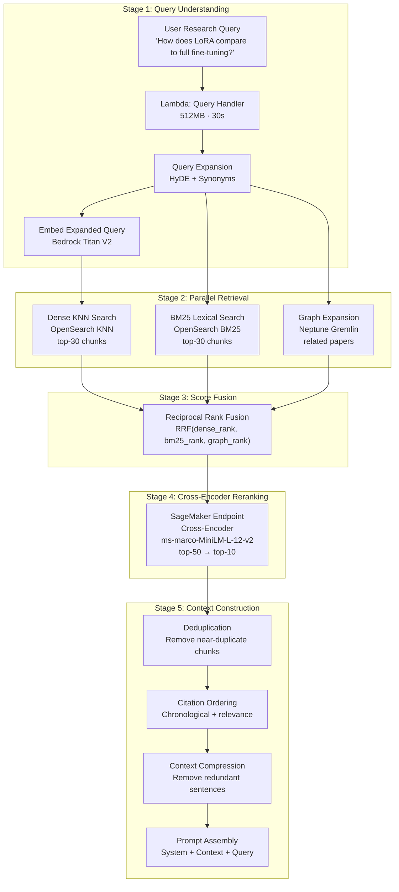

# 🔍 Retrieval Engine — Research Domain Enquirer

> Covers: Query understanding · Dense retrieval · BM25 retrieval · Graph expansion · Score fusion · Cross-encoder reranking · Context construction

---

## Overview

The Retrieval Engine receives a user's research question and orchestrates three parallel retrieval signals, fuses them, reranks, and builds a compressed context for the LLM.



---

## Stage 1: Query Understanding

### What happens to the user query

```
Input: "How does LoRA compare to full fine-tuning on large language models?"

Step 1: Query Classification
  type: "comparison"
  entities: ["LoRA", "full fine-tuning", "large language models"]
  intent: "compare methods"

Step 2: Hypothetical Document Embedding (HyDE)
  Generate a hypothetical ideal answer snippet:
  "LoRA (Low-Rank Adaptation) achieves comparable performance to full fine-tuning
   while using only 0.1% of trainable parameters. On GLUE benchmark, LoRA
   fine-tuned LLaMA achieves 87.3 vs 88.1 for full fine-tuning, with 10× less
   memory. The key advantage is that LoRA freezes base model weights..."
  → Embed this hypothetical text as the query vector

Step 3: Query Expansion
  Synonyms/acronyms added:
  "LoRA" → ["Low-Rank Adaptation", "PEFT", "parameter-efficient"]
  "full fine-tuning" → ["full FT", "FFT", "complete fine-tuning"]
  Combined BM25 query:
  "(LoRA OR 'Low-Rank Adaptation' OR PEFT) AND (fine-tuning OR 'full FT')
   AND ('large language model' OR LLM)"

Step 4: Metadata Filters (optional, from user)
  date_from: "2023-01-01"
  categories: ["cs.CL", "cs.LG"]
```

### Lambda: Query Handler Spec

```
Memory: 512 MB
Timeout: 30s
Trigger: API Gateway POST /query
Concurrency: unreserved (scales with traffic)

Bedrock calls in Query Understanding:
1. Claude 3 Haiku → query classification + HyDE generation (~100ms)
2. Titan Embeddings V2 → embed HyDE text (~50ms)
```

---

## Stage 2: Parallel Retrieval (3 Sources)

All three retrieval sources run **in parallel** using Python asyncio:

```python
async def retrieve_parallel(query_embedding, query_text, entities):
    results = await asyncio.gather(
        dense_search(query_embedding, k=30),
        bm25_search(query_text, k=30),
        graph_expansion(entities, depth=2, limit=20)
    )
    return results
```

### 2A. Dense Retrieval (OpenSearch KNN)

```json
POST /paper_chunks/_search
{
  "size": 30,
  "query": {
    "knn": {
      "embedding": {
        "vector": "<hyde_embedding_1536_dims>",
        "k": 30
      }
    }
  },
  "filter": {
    "bool": {
      "should": [
        { "terms": { "entities": ["LoRA", "Low-Rank Adaptation"] } }
      ]
    }
  },
  "_source": ["chunk_id", "paper_id", "text", "section_title", "page",
              "published_date", "authors", "entities"]
}
```

Returns: 30 chunks with cosine similarity scores [0.0 → 1.0]

### 2B. BM25 Retrieval (OpenSearch Full-Text)

```json
POST /paper_chunks/_search
{
  "size": 30,
  "query": {
    "bool": {
      "should": [
        {
          "multi_match": {
            "query": "LoRA Low-Rank Adaptation PEFT fine-tuning LLM",
            "fields": ["text^2", "title^3", "abstract^1.5", "entities^2.5"],
            "type": "best_fields",
            "minimum_should_match": "2"
          }
        }
      ]
    }
  },
  "_source": ["chunk_id", "paper_id", "text", "section_title", "page",
              "published_date", "authors"]
}
```

Returns: 30 chunks with BM25 scores (unbounded, normalized later)

### 2C. Graph Expansion (Neptune Gremlin)

Graph expansion retrieves papers related to the query entities through graph traversal:

```python
entities_found = ["LoRA", "full fine-tuning", "LLaMA"]

# Step 1: Find entity vertices
entity_vertices = g.V().has('Method', 'name', within(entities_found)).toList()
entity_vertices += g.V().has('Concept', 'name', within(entities_found)).toList()

# Step 2: Find papers using these entities
related_papers = (
    g.V(entity_vertices)
     .in('PROPOSES', 'INTRODUCES', 'EVALUATES_ON')  # papers using these entities
     .hasLabel('Paper')
     .dedup()
     .order().by('published_date', desc)
     .limit(20)
     .valueMap('paper_id', 'title', 'published_date')
     .toList()
)

# Step 3: For each related paper, fetch its most relevant chunks from OpenSearch
for paper in related_papers:
    chunks = opensearch.get(
        index='paper_chunks',
        body={'query': {'term': {'paper_id': paper['paper_id']}},
              'size': 3,
              'sort': [{'_score': 'desc'}]}
    )
```

Graph expansion provides **citation context** and **entity neighborhood** chunks that pure vector search might miss.

---

## Stage 3: Reciprocal Rank Fusion (RRF)

RRF combines rankings from multiple sources without needing score normalization:

```python
def reciprocal_rank_fusion(rankings: list[list[str]], k: int = 60) -> dict[str, float]:
    """
    rankings: list of ranked chunk_id lists from each retrieval source
    k: RRF constant (default 60 is standard)
    Returns: {chunk_id: rrf_score}
    """
    scores = defaultdict(float)
    for ranked_list in rankings:
        for rank, chunk_id in enumerate(ranked_list, start=1):
            scores[chunk_id] += 1.0 / (k + rank)
    return dict(sorted(scores.items(), key=lambda x: x[1], reverse=True))
```

### RRF Example

```
Dense results (top 5):   [A, B, C, D, E]  → A gets 1/(60+1)=0.0164, B gets 0.0161...
BM25 results (top 5):    [C, A, F, G, B]  → C gets 0.0164, A gets 0.0161...
Graph results (top 5):   [A, D, H, C, I]  → A gets 0.0164, D gets 0.0161...

Fused RRF scores:
  A: 0.0164+0.0161+0.0164 = 0.0489  ← top! (appeared in all 3)
  C: 0.0159+0.0164+0.0154 = 0.0477
  D: 0.0158+0+0.0161      = 0.0319
  B: 0.0161+0.0154+0      = 0.0315
```

RRF top-50 candidates are passed to the cross-encoder reranker.

---

## Stage 4: Cross-Encoder Reranking (SageMaker)

### Why Cross-Encoder?

Bi-encoders (embedding models) encode query and document independently — fast but approximate.  
Cross-encoders encode (query, document) **together** — slower but much more accurate.

```
Bi-encoder: embed(query) · embed(doc) → score   [fast, ~50ms for 100 docs]
Cross-encoder: encode(query + doc) → score       [slow, ~500ms for 100 docs]

We use bi-encoder for candidate retrieval (top-50),
then cross-encoder to re-score and rerank (top-50 → top-10).
```

### SageMaker Cross-Encoder Endpoint

| Property | Value |
|----------|-------|
| Model | `cross-encoder/ms-marco-MiniLM-L-12-v2` (HuggingFace) |
| Instance | `ml.g4dn.xlarge` (T4 GPU, 16 GB VRAM) |
| Max input length | 512 tokens (query + chunk) |
| Latency | ~80ms per candidate batch of 20 |
| Auto-scaling | Min=1, Max=3, scale on `CPUUtilization > 70` |

### Reranker Lambda Invocation

```python
# Lambda invokes SageMaker endpoint
payload = {
    "pairs": [
        {
            "query": "How does LoRA compare to full fine-tuning?",
            "document": chunk["text"]
        }
        for chunk in top_50_candidates
    ]
}

response = sagemaker_runtime.invoke_endpoint(
    EndpointName="cross-encoder-reranker",
    ContentType="application/json",
    Body=json.dumps(payload)
)

scores = json.loads(response["Body"].read())["scores"]
# scores: [0.92, 0.87, 0.43, ...] for each pair

# Sort by score, take top 10
ranked = sorted(zip(top_50_candidates, scores), key=lambda x: x[1], reverse=True)
top_10 = [chunk for chunk, score in ranked[:10]]
```

---

## Stage 5: Context Construction

### Step 1: Deduplication

Remove near-duplicate chunks (same paper, adjacent sections):

```python
def deduplicate_chunks(chunks: list) -> list:
    seen_paper_sections = set()
    seen_content_hashes = set()
    unique = []
    
    for chunk in chunks:
        # Remove duplicate sections from same paper
        key = (chunk["paper_id"], chunk["section_id"])
        content_hash = hashlib.md5(chunk["text"][:200].encode()).hexdigest()
        
        if key not in seen_paper_sections and content_hash not in seen_content_hashes:
            seen_paper_sections.add(key)
            seen_content_hashes.add(content_hash)
            unique.append(chunk)
    
    return unique
```

### Step 2: Citation Ordering

Order chunks chronologically within relevance tiers:

```python
def order_chunks(chunks: list) -> list:
    # Tier 1: Highest reranker score (>0.8) — most relevant
    # Tier 2: Medium score (0.5–0.8) — supporting evidence  
    # Tier 3: Graph-expanded (context papers)
    
    # Within each tier, sort by published_date descending (newest first)
    tier1 = sorted([c for c in chunks if c["rerank_score"] > 0.8],
                   key=lambda x: x["published_date"], reverse=True)
    tier2 = sorted([c for c in chunks if 0.5 <= c["rerank_score"] <= 0.8],
                   key=lambda x: x["published_date"], reverse=True)
    tier3 = [c for c in chunks if c.get("source") == "graph"]
    
    return tier1 + tier2 + tier3
```

### Step 3: Context Compression

For chunks exceeding token budget, compress by removing redundant sentences:

```
Token budget: 8000 tokens for context (leaving room for system prompt + query)

If total context > 8000 tokens:
  1. Keep Tier 1 chunks whole (most relevant — don't truncate)
  2. For Tier 2+: extract top-3 most relevant sentences per chunk
     using BERT-based extractive summarization (run in Lambda)
  3. Truncate Tier 3 to abstracts only
```

### Step 4: Prompt Assembly

```
SYSTEM:
You are an expert AI research assistant. Answer the question based ONLY on the
provided research paper excerpts. For every claim you make, cite the specific
paper using [paper_id] notation. If the evidence is insufficient, say so clearly.

CONTEXT:
[Paper 2401.12345] "LoRA: Low-Rank Adaptation of Large Language Models"
Authors: Hu et al. (2022) | Section: Abstract
---
LoRA proposes freezing pre-trained model weights and injecting trainable rank
decomposition matrices into each Transformer layer...

[Paper 2401.99999] "Full Fine-Tuning vs Parameter-Efficient Methods: A Survey"
Authors: Chen et al. (2024) | Section: 3. Comparison
---
Full fine-tuning updates all model parameters during training, typically
requiring 16× more GPU memory than LoRA...

[more chunks...]

QUERY:
How does LoRA compare to full fine-tuning on large language models?

ANSWER:
```

---

## Retrieval Latency Budget

| Stage | Target Latency |
|-------|---------------|
| Query understanding (Claude Haiku + Titan) | 150ms |
| Dense + BM25 parallel retrieval | 100ms |
| Graph expansion (Neptune) | 200ms |
| RRF fusion | 5ms |
| Cross-encoder reranking (SageMaker) | 150ms |
| Context construction | 20ms |
| **Total retrieval** | **~625ms** |
| LLM generation (Claude 3.5 Sonnet, streaming) | 2–5s |
| Hallucination verification (Claude Haiku) | 300ms |
| **Total end-to-end** | **~3–6s** |

---

## API Gateway Endpoints

### POST /query

**Request:**
```json
{
  "question": "How does LoRA compare to full fine-tuning?",
  "filters": {
    "date_from": "2022-01-01",
    "categories": ["cs.LG", "cs.CL"],
    "top_k": 10
  },
  "options": {
    "stream": true,
    "include_graph": true,
    "include_evaluation": false
  }
}
```

**Response (streaming via WebSocket):**
```json
{
  "answer": "LoRA significantly reduces memory requirements compared to full fine-tuning [2401.12345]...",
  "citations": [
    {
      "paper_id": "2401.12345",
      "title": "LoRA: Low-Rank Adaptation of Large Language Models",
      "authors": ["Hu, E.", "Shen, Y."],
      "published": "2021-10-16",
      "section": "Abstract",
      "relevance_score": 0.94
    }
  ],
  "graph_context": {
    "entities": ["LoRA", "full fine-tuning", "LLaMA"],
    "related_papers": [...],
    "relationships": [
      { "source": "LoRA", "relation": "IMPROVES", "target": "GLUE benchmark" }
    ]
  },
  "confidence": 0.91,
  "retrieval_metadata": {
    "chunks_retrieved": 10,
    "dense_candidates": 30,
    "bm25_candidates": 30,
    "graph_candidates": 15,
    "reranked_from": 50
  }
}
```

---

*See [HALLUCINATION_DETECTION.md](./HALLUCINATION_DETECTION.md) for how the answer is verified post-generation.*
