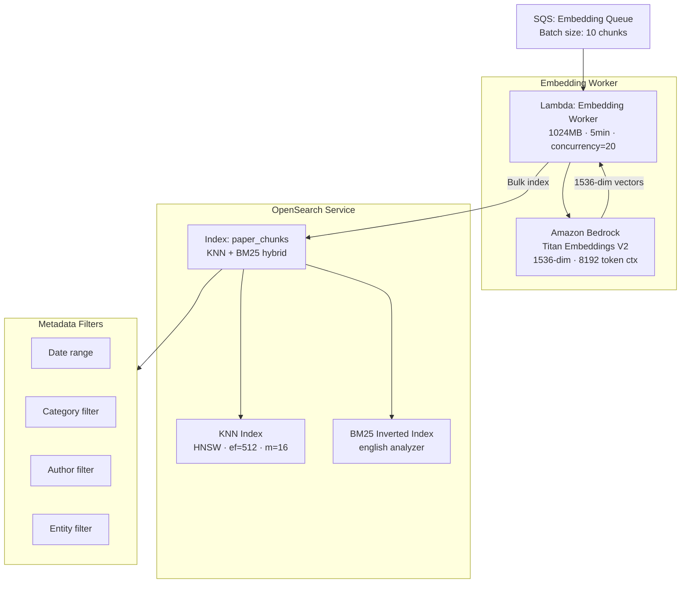

# 🧠 Vector Pipeline — Research Domain Enquirer

> Covers: Late chunk embedding storage · OpenSearch KNN index · BM25 full-text index · Titan Embeddings V2 · index management

---

## Overview

The Vector Pipeline stores chunk embeddings and enables two complementary search modes:
1. **Dense (Semantic) Search** — KNN over 1536-dim Titan embeddings  
2. **BM25 (Lexical) Search** — Full-text inverted index  

Both indexes live in **Amazon OpenSearch Service**, allowing a single query to fuse both results.



---

## Amazon OpenSearch Configuration

### Cluster Specs

| Property | Value |
|----------|-------|
| Service | Amazon OpenSearch Service |
| Version | OpenSearch 2.11 |
| Master nodes | `m6g.large.search` × 3 (dedicated) |
| Data nodes | `r6g.large.search` × 3 (AZ-spread) |
| Storage per node | 500 GB gp3 EBS |
| Total capacity | 1.5 TB raw (usable ~1 TB with replication) |
| Replica shards | 1 replica per primary (HA) |
| Zone awareness | Enabled (3 AZ) |
| VPC | Private subnet (no public endpoint) |
| Encryption | At-rest (KMS) + In-transit (TLS 1.2+) |
| Fine-grained access | IAM + OpenSearch security plugin |

### Shard Strategy

```
Index: paper_chunks
Primary shards: 6
Replica shards: 1 each → 12 shards total

Shard sizing:
  Target shard size: ~10-15 GB
  Estimated documents: 5M chunks (500 docs/paper × 10K papers)
  Average doc size: ~5 KB (text + 1536 floats × 4 bytes = ~6.5 KB)
  Total index size: ~32 GB → fits in 6 shards of ~5 GB each
  Headroom for 30× growth without reshard
```

---

## Index Mapping

### Full Mapping: `paper_chunks`

```json
{
  "settings": {
    "number_of_shards": 6,
    "number_of_replicas": 1,
    "index": {
      "knn": true,
      "knn.algo_param.ef_search": 512,
      "refresh_interval": "30s"
    },
    "analysis": {
      "analyzer": {
        "research_analyzer": {
          "type": "custom",
          "tokenizer": "standard",
          "filter": ["lowercase", "english_stop", "english_stemmer", "asciifolding"]
        }
      },
      "filter": {
        "english_stop": { "type": "stop", "stopwords": "_english_" },
        "english_stemmer": { "type": "stemmer", "language": "english" }
      }
    }
  },
  "mappings": {
    "properties": {
      "chunk_id":        { "type": "keyword" },
      "paper_id":        { "type": "keyword" },
      "section_id":      { "type": "keyword" },
      "section_title":   { "type": "keyword" },
      "chunk_index":     { "type": "integer" },
      "text": {
        "type": "text",
        "analyzer": "research_analyzer",
        "term_vector": "with_positions_offsets"
      },
      "embedding": {
        "type": "knn_vector",
        "dimension": 1536,
        "method": {
          "name": "hnsw",
          "space_type": "cosinesimil",
          "engine": "nmslib",
          "parameters": {
            "ef_construction": 512,
            "m": 16
          }
        }
      },
      "page":            { "type": "integer" },
      "published_date":  { "type": "date", "format": "yyyy-MM-dd" },
      "authors":         { "type": "keyword" },
      "categories":      { "type": "keyword" },
      "entities":        { "type": "keyword" },
      "concepts":        { "type": "keyword" },
      "token_count":     { "type": "integer" },
      "char_count":      { "type": "integer" },
      "ingested_at":     { "type": "date" },
      "title": {
        "type": "text",
        "analyzer": "research_analyzer",
        "fields": {
          "keyword": { "type": "keyword" }
        }
      },
      "abstract": {
        "type": "text",
        "analyzer": "research_analyzer"
      }
    }
  }
}
```

---

## Titan Embeddings V2 — Details

### Model Specification

| Property | Value |
|----------|-------|
| Model ID | `amazon.titan-embed-text-v2:0` |
| Dimensions | 1536 (default) |
| Max input tokens | 8192 |
| Normalization | L2 normalized (cosine ready) |
| Cost | $0.00002 per 1K tokens |
| Throughput (Bedrock) | ~25 requests/sec per region |

### Invocation Pattern

```json
Request to Bedrock:
{
  "modelId": "amazon.titan-embed-text-v2:0",
  "contentType": "application/json",
  "accept": "application/json",
  "body": {
    "inputText": "We present a novel attention mechanism that...",
    "dimensions": 1536,
    "normalize": true
  }
}

Response:
{
  "embedding": [0.0234, -0.0412, 0.0891, ...],  // 1536 floats
  "inputTextTokenCount": 312
}
```

### Bedrock Throttling Handling

```
Lambda Embedding Worker strategy:
1. Process 10 chunks per Lambda invocation (SQS batch)
2. For each chunk:
   a. Call Bedrock with exponential backoff:
      retries: 5
      base_delay: 1s
      max_delay: 60s
      jitter: random(0, base_delay)
   b. On ThrottlingException: wait and retry
   c. On ModelTimeoutException: retry immediately (1×)
   d. On permanent error: send chunk to DLQ
3. Bulk-index all 10 chunk embeddings to OpenSearch in one request
```

---

## Lambda: Embedding Worker

| Property | Value |
|----------|-------|
| Runtime | Python 3.11 |
| Memory | 1024 MB |
| Timeout | 5 min |
| Concurrency | Reserved = 20 |
| Trigger | SQS Embedding Queue (batch size = 10) |
| IAM | Bedrock:InvokeModel, OpenSearch write |

### Batch Index Request to OpenSearch

```json
POST /_bulk
{ "index": { "_index": "paper_chunks", "_id": "2401.12345_abstract_chunk0" } }
{ "chunk_id": "2401.12345_abstract_chunk0", "paper_id": "2401.12345", "text": "...", "embedding": [...], "published_date": "2024-01-15", ... }
{ "index": { "_index": "paper_chunks", "_id": "2401.12345_abstract_chunk1" } }
{ "chunk_id": "...", ... }
```

Error handling: partial bulk failures are caught, failed docs re-queued individually.

---

## Search Modes

### 1. Dense KNN Search

```json
POST /paper_chunks/_search
{
  "size": 20,
  "query": {
    "knn": {
      "embedding": {
        "vector": [0.023, -0.041, ...],
        "k": 20
      }
    }
  },
  "_source": ["chunk_id", "paper_id", "text", "section_title", "page", "entities"],
  "filter": {
    "bool": {
      "must": [
        { "range": { "published_date": { "gte": "2023-01-01" } } },
        { "terms": { "categories": ["cs.AI", "cs.LG"] } }
      ]
    }
  }
}
```

Returns top-20 semantically similar chunks with cosine similarity scores.

### 2. BM25 Full-Text Search

```json
POST /paper_chunks/_search
{
  "size": 20,
  "query": {
    "multi_match": {
      "query": "attention mechanism transformer architecture",
      "fields": ["text^2", "title^3", "abstract^1.5", "entities^2"],
      "type": "best_fields",
      "tie_breaker": 0.3
    }
  },
  "_source": ["chunk_id", "paper_id", "text", "section_title"],
  "highlight": {
    "fields": { "text": { "number_of_fragments": 2 } }
  }
}
```

Returns top-20 lexically matched chunks with BM25 scores.

### 3. Hybrid Search (Neural + BM25)

OpenSearch's built-in hybrid search with score normalization:

```json
POST /paper_chunks/_search
{
  "size": 20,
  "_source": ["chunk_id", "paper_id", "text", "section_title", "page"],
  "query": {
    "hybrid": {
      "queries": [
        {
          "knn": {
            "embedding": {
              "vector": [0.023, -0.041, ...],
              "k": 30
            }
          }
        },
        {
          "multi_match": {
            "query": "attention mechanism transformer",
            "fields": ["text^2", "title^3", "entities^2"]
          }
        }
      ]
    }
  },
  "search_pipeline": {
    "phase_results_processors": [
      {
        "normalization-processor": {
          "normalization": { "technique": "min_max" },
          "combination": {
            "technique": "arithmetic_mean",
            "parameters": { "weights": [0.7, 0.3] }
          }
        }
      }
    ]
  }
}
```

Dense gets 70% weight, BM25 gets 30% weight — tunable via config.

---

## Index Lifecycle Management

### Rollover Strategy

```
Policy: research-ilm-policy

Phase: hot (0-30 days)
  - Priority: 100
  - Rollover: max_size=50GB OR max_age=30d

Phase: warm (30-180 days)
  - Move to warm nodes (fewer replicas)
  - Force merge to 1 segment
  - Replica: 0 (cost saving)

Phase: cold (180d+)
  - Move to UltraWarm storage (S3-backed)
  - Replica: 0
  - Read-only
```

### Alias Management

```
Write alias: paper_chunks_write → paper_chunks_v1 (current)
Read alias:  paper_chunks_read  → paper_chunks_v* (all versions)

On rollover: paper_chunks_v2 becomes new write target
             paper_chunks_v1 stays readable via read alias
```

---

## OpenSearch Pipelines (Ingest Pipeline)

### Text preprocessing before indexing

```json
PUT /_ingest/pipeline/research_preprocess
{
  "processors": [
    {
      "trim": { "field": "text" }
    },
    {
      "set": {
        "field": "ingested_at",
        "value": "{{_ingest.timestamp}}"
      }
    },
    {
      "script": {
        "lang": "painless",
        "source": "ctx.token_count = ctx.text.split(' ').length"
      }
    }
  ]
}
```

---

## Cost Estimates

| Component | Monthly Cost Estimate |
|-----------|----------------------|
| OpenSearch 3× r6g.large + 1.5TB EBS | ~$600–$800 |
| Titan Embeddings (100K chunks/month) | ~$30 |
| Lambda Embedding Worker (100K invocations) | ~$2 |
| Data transfer (Lambda → OpenSearch VPC) | Free (VPC) |
| **Total Vector Pipeline** | **~$630–$830/month** |

---

*See [RETRIEVAL_ENGINE.md](./RETRIEVAL_ENGINE.md) for how dense + BM25 results are fused with graph expansion.*
